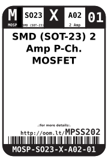
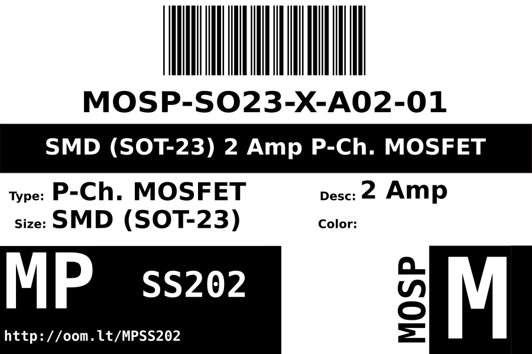
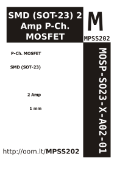

Contents
========

* [MOSP-SO23-X-A02-01>SMD (SOT-23) 2 Amp P-Ch. MOSFET](#mosp-so23-x-a02-01smd-sot-23-2-amp-p-ch-mosfet)
	* [Datasheets](#datasheets)
	* [Labels](#labels)
	* [EDA](#eda)
		* [Symbols](#symbols)
	* [Tags](#tags)

# MOSP-SO23-X-A02-01>SMD (SOT-23) 2 Amp P-Ch. MOSFET

- ID: MOSP-SO23-X-A02-01
- Name: MOSP-SO23-X-A02-01

## Datasheets

- Datasheet: [datasheet.pdf](datasheet.pdf)

## Labels
  
  

|Front|Inventory|Specifications|
| :---: | :---: | :---: |
||||

## EDA

### Symbols

## Tags

- index: 401
- index: 9876
- oompID: MOSP-SO23-X-A02-01
- name: SMD (SOT-23) 2 Amp P-Ch. MOSFET
- hexID: MPSS202
- oompSort: SO2302.000
- oompType: MOSP
- oompSize: SO23
- oompColor: X
- oompDesc: A02
- oompIndex: 01
- oompVersion: 99
- oompSkip: true
- ooWidth: 3 mm
- ooHeight: 1 mm
- ooLength: 2.3 mm
- com: SMD
- ooPackageMarking: 340
- ooPackageMarking: 340
- ooNumPins: 3
- oompClass: Surface Mount
- oompClassCode: SMDS
- ooPin1: G
- ooPin2: S
- ooPin3: D
- oompBbls: template;XXXX-SO23-X-XXXX-01-bbls
- oompDiag: template;XXXX-SO23-X-XXXX-01-diag
- oompIden: template;XXXX-SO23-X-XXXX-01-iden
- oompSimp: template;XXXX-SO23-X-XXXX-01-simp
- ooDesignator: Q1
