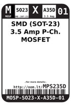
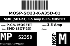
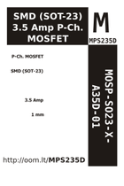

Contents
========

* [MPS235D > SMD (SOT-23) 3.5 Amp P-Ch. MOSFET](#mps235d--smd-sot-23-35-amp-p-ch-mosfet)
	* [Images](#images)
	* [Datasheets](#datasheets)
	* [Labels](#labels)
	* [EDA](#eda)
	* [Tags](#tags)

# MPS235D > SMD (SOT-23) 3.5 Amp P-Ch. MOSFET

- ID: MOSP-SO23-X-A35D-01
- Hex ID: MPS235D
- Name: SMD (SOT-23) 3.5 Amp P-Ch. MOSFET
- Description: SMD (SOT-23) 3.5 Amp P-Ch. MOSFET

## Images
  
  

|label-front|label-inventory|label-spec|
| :---: | :---: | :---: |
||||

## Datasheets

- Datasheet: [datasheet.pdf](datasheet.pdf)

## Labels
  
  

|label-front|label-inventory|label-spec|
| :---: | :---: | :---: |
||||

## EDA

### Symbols

## Tags

- oompID: MOSP-SO23-X-A35D-01
- name: SMD (SOT-23) 3.5 Amp P-Ch. MOSFET
- hexID: MPS235D
- oompSort: 
- oompClass: Surface Mount
- oompClassCode: SMDS
- oompType: MOSP
- oompSize: SO23
- oompColor: X
- oompDesc: A35D
- oompIndex: 01
- oompVersion: 40
- ooPin1: G
- ooPin2: S
- ooPin3: D
- oompBbls: template;XXXX-SO23-X-XXXX-01-bbls
- oompDiag: template;XXXX-SO23-X-XXXX-01-diag
- oompIden: template;XXXX-SO23-X-XXXX-01-iden
- oompSimp: template;XXXX-SO23-X-XXXX-01-simp
- ooDesignator: Q1
