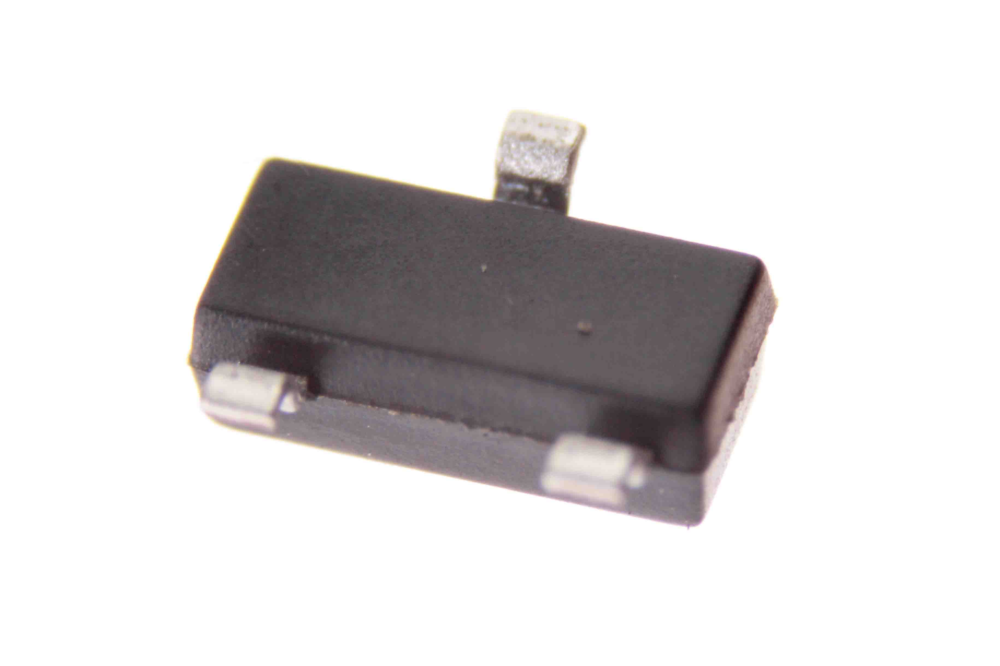

Contents
========

* [MOSP-SO23-X-A41D-01>SMD (SOT-23) 4.1 Amp P-Ch. MOSFET](#mosp-so23-x-a41d-01smd-sot-23-41-amp-p-ch-mosfet)
	* [Images](#images)
	* [Datasheets](#datasheets)
	* [Labels](#labels)
	* [EDA](#eda)
		* [Symbols](#symbols)
	* [Tags](#tags)
  
![][im]
# MOSP-SO23-X-A41D-01>SMD (SOT-23) 4.1 Amp P-Ch. MOSFET

- ID: MOSP-SO23-X-A41D-01
- Name: MOSP-SO23-X-A41D-01

## Images
  
  

|Main|Bottom|
| :---: | :---: |
|||

## Datasheets

- Datasheet: [datasheet.pdf](datasheet.pdf)

## Labels
  
  

|Front|Inventory|Specifications|
| :---: | :---: | :---: |
||||

## EDA

### Symbols

## Tags

- index: 12702
- oompID: MOSP-SO23-X-A41D-01
- name: SMD (SOT-23) 4.1 Amp P-Ch. MOSFET
- hexID: MPS241D
- oompSort: 
- oompClass: Surface Mount
- oompClassCode: SMDS
- oompType: MOSP
- oompSize: SO23
- oompColor: X
- oompDesc: A41D
- oompIndex: 01
- oompVersion: 40
- ooPin1: G
- ooPin2: S
- ooPin3: D
- oompBbls: template;XXXX-SO23-X-XXXX-01-bbls
- oompDiag: template;XXXX-SO23-X-XXXX-01-diag
- oompIden: template;XXXX-SO23-X-XXXX-01-iden
- oompSimp: template;XXXX-SO23-X-XXXX-01-simp
- ooPackageMarking: S5
- ooDesignator: Q1

[im]: image_600.jpg
