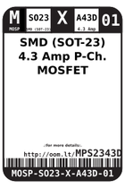
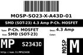
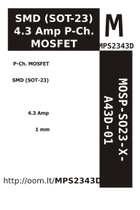
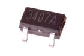

Contents
========

* [MPS2343D > SMD (SOT-23) 4.3 Amp P-Ch. MOSFET](#mps2343d--smd-sot-23-43-amp-p-ch-mosfet)
	* [Datasheets](#datasheets)
	* [Labels](#labels)
	* [EDA](#eda)
	* [Images](#images)
	* [Tags](#tags)
  
![][im]
# MPS2343D > SMD (SOT-23) 4.3 Amp P-Ch. MOSFET

- ID: MOSP-SO23-X-A43D-01
- Hex ID: MPS2343D
- Name: SMD (SOT-23) 4.3 Amp P-Ch. MOSFET
- Description: SMD (SOT-23) 4.3 Amp P-Ch. MOSFET
- Long Link: [http://oom.lt/MOSP-SO23-X-A43D-01](http://oom.lt/MOSP-SO23-X-A43D-01)
- Short Link: [http://oom.lt/MPS2343D](http://oom.lt/MPS2343D)

## Datasheets

- Datasheet: [datasheet.pdf](datasheet.pdf)

## Labels
  
  

|label-front|label-inventory|label-spec|
| :---: | :---: | :---: |
||||

## EDA

### Symbols

## Images
  
  

|image|label-front|label-inventory|label-spec|
| :---: | :---: | :---: | :---: |
|||||

## Tags

- oompID: MOSP-SO23-X-A43D-01
- name: SMD (SOT-23) 4.3 Amp P-Ch. MOSFET
- hexID: MPS2343D
- oompSort: MOSPSO23A43D
- oompType: MOSP
- oompSize: SO23
- oompColor: X
- oompDesc: A43D
- oompIndex: 01
- oompVersion: 98
- ooNumPins: 3
- ooPin1: G
- ooPin2: S
- ooPin3: D
- oompBbls: template;XXXX-SO23-X-XXXX-01-bbls
- oompDiag: template;XXXX-SO23-X-XXXX-01-diag
- oompIden: template;XXXX-SO23-X-XXXX-01-iden
- oompSimp: template;XXXX-SO23-X-XXXX-01-simp
- ooPackageMarking: 3407A
- ooDesignator: Q1

[im]: image_450.jpg
