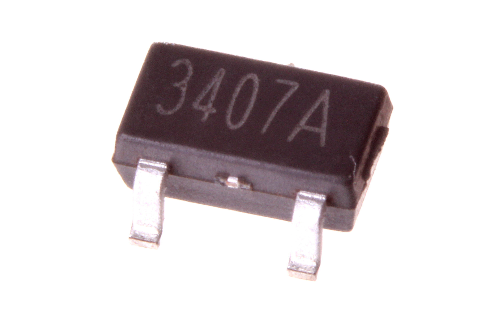

Contents
========

* [MOSP-SO23-X-A43D-01>SMD (SOT-23) 4.3 Amp P-Ch. MOSFET](#mosp-so23-x-a43d-01smd-sot-23-43-amp-p-ch-mosfet)
	* [Images](#images)
	* [Datasheets](#datasheets)
	* [EDA](#eda)
		* [Footprints](#footprints)
		* [Symbols](#symbols)
	* [Tags](#tags)

# MOSP-SO23-X-A43D-01>SMD (SOT-23) 4.3 Amp P-Ch. MOSFET

- ID: MOSP-SO23-X-A43D-01
- Name: MOSP-SO23-X-A43D-01

## Images
  
  

|Main|
| :---: |
||

## Datasheets

- Datasheet: [datasheet.pdf](datasheet.pdf)

## EDA

### Footprints
  

|||||
| :---: | :---: | :---: | :---: |

### Symbols

## Tags

- index: 404
- oompID: MOSP-SO23-X-A43D-01
- name: SMD (SOT-23) 4.3 Amp P-Ch. MOSFET
- hexID: MPS2343D
- oompSort: MOSPSO23A43D
- oompType: MOSP
- oompSize: SO23
- oompColor: X
- oompDesc: A43D
- oompIndex: 01
- oompVersion: 98
- ooNumPins: 3
- ooPin1: G
- ooPin2: S
- ooPin3: D
- oompBbls: template;XXXX-SO23-X-XXXX-01-bbls
- oompDiag: template;XXXX-SO23-X-XXXX-01-diag
- oompIden: template;XXXX-SO23-X-XXXX-01-iden
- oompSimp: template;XXXX-SO23-X-XXXX-01-simp
- ooPackageMarking: 3407A
- ooDesignator: Q1
