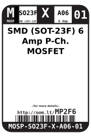
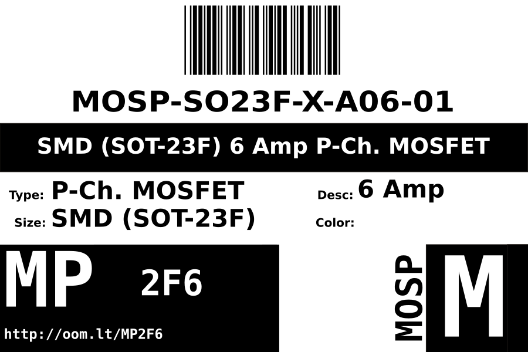

Contents
========

* [MOSP-SO23F-X-A06-01>SMD (SOT-23F) 6 Amp P-Ch. MOSFET](#mosp-so23f-x-a06-01smd-sot-23f-6-amp-p-ch-mosfet)
	* [Datasheets](#datasheets)
	* [Labels](#labels)
	* [EDA](#eda)
		* [Symbols](#symbols)
	* [Tags](#tags)

# MOSP-SO23F-X-A06-01>SMD (SOT-23F) 6 Amp P-Ch. MOSFET

- ID: MOSP-SO23F-X-A06-01
- Name: MOSP-SO23F-X-A06-01

## Datasheets

- Datasheet: [datasheet.pdf](datasheet.pdf)

## Labels
  
  

|Front|Inventory|Specifications|
| :---: | :---: | :---: |
||||

## EDA

### Symbols

## Tags

- index: 405
- oompID: MOSP-SO23F-X-A06-01
- name: SMD (SOT-23F) 6 Amp P-Ch. MOSFET
- hexID: MP2F6
- oompSort: MOSPSO23FA06
- oompType: MOSP
- oompSize: SO23F
- oompColor: X
- oompDesc: A06
- oompIndex: 01
- oompVersion: 98
- ooPin1: G
- ooPin2: S
- ooPin3: D
- oompBbls: template;XXXX-SO23F-X-XXXX-01-bbls
- oompDiag: template;XXXX-SO23F-X-XXXX-01-diag
- oompIden: template;XXXX-SO23F-X-XXXX-01-iden
- oompSimp: template;XXXX-SO23F-X-XXXX-01-simp
- ooDesignator: Q1
