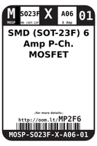
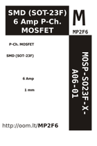

Contents
========

* [MP2F6 > SMD (SOT-23F) 6 Amp P-Ch. MOSFET](#mp2f6--smd-sot-23f-6-amp-p-ch-mosfet)
	* [Images](#images)
	* [Datasheets](#datasheets)
	* [Labels](#labels)
	* [EDA](#eda)
	* [Tags](#tags)

# MP2F6 > SMD (SOT-23F) 6 Amp P-Ch. MOSFET

- ID: MOSP-SO23F-X-A06-01
- Hex ID: MP2F6
- Name: SMD (SOT-23F) 6 Amp P-Ch. MOSFET
- Description: SMD (SOT-23F) 6 Amp P-Ch. MOSFET

## Images
  
  

|label-front|label-inventory|label-spec|
| :---: | :---: | :---: |
||||

## Datasheets

- Datasheet: [datasheet.pdf](datasheet.pdf)

## Labels
  
  

|label-front|label-inventory|label-spec|
| :---: | :---: | :---: |
||||

## EDA

### Symbols

## Tags

- oompID: MOSP-SO23F-X-A06-01
- name: SMD (SOT-23F) 6 Amp P-Ch. MOSFET
- hexID: MP2F6
- oompSort: MOSPSO23FA06
- oompType: MOSP
- oompSize: SO23F
- oompColor: X
- oompDesc: A06
- oompIndex: 01
- oompVersion: 98
- ooPin1: G
- ooPin2: S
- ooPin3: D
- oompBbls: template;XXXX-SO23F-X-XXXX-01-bbls
- oompDiag: template;XXXX-SO23F-X-XXXX-01-diag
- oompIden: template;XXXX-SO23F-X-XXXX-01-iden
- oompSimp: template;XXXX-SO23F-X-XXXX-01-simp
- ooDesignator: Q1
