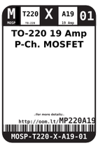
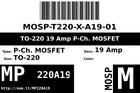

Contents
========

* [MP220A19 > TO-220 19 Amp P-Ch. MOSFET](#mp220a19--to-220-19-amp-p-ch-mosfet)
	* [Datasheets](#datasheets)
	* [Labels](#labels)
	* [EDA](#eda)
	* [Images](#images)
	* [Tags](#tags)

# MP220A19 > TO-220 19 Amp P-Ch. MOSFET

- ID: MOSP-T220-X-A19-01
- Hex ID: MP220A19
- Name: TO-220 19 Amp P-Ch. MOSFET
- Description: TO-220 19 Amp P-Ch. MOSFET
- Long Link: [http://oom.lt/MOSP-T220-X-A19-01](http://oom.lt/MOSP-T220-X-A19-01)
- Short Link: [http://oom.lt/MP220A19](http://oom.lt/MP220A19)

## Datasheets

- Datasheet: [datasheet.pdf](datasheet.pdf)

## Labels
  
  

|label-front|label-inventory|label-spec|
| :---: | :---: | :---: |
||||

## EDA

## Images
  
  

|label-front|label-inventory|label-spec|
| :---: | :---: | :---: |
||||

## Tags

- oompID: MOSP-T220-X-A19-01
- name: TO-220 19 Amp P-Ch. MOSFET
- oompSort: 
- oompType: MOSP
- oompSize: T220
- oompColor: X
- oompDesc: A19
- oompIndex: 01
- oompVersion: 999
- hexID: MP220A19
- ooPitch: 2.54 mm
- oonumPins: 3
- oonumRows: 1
- oopin1: G
- oopin1X: 0
- ooPin1Y: 0
- oopin2: D
- oopin2X: 0
- ooPin2Y: 0.1"
- oopin3: S
- oopin3X: 0
- ooPin3Y: 0.2"
- oompSymbol: oneSidedPackage;##ooNumPins@@
- oompFootprint: oneSidedPackage;##ooNumPins@@;##ooPitch@@
- oompBbls: template;XXXX-T220-X-XXXX-01-bbls
- oompDiag: template;XXXX-T220-X-XXXX-01-diag
- oompIden: template;XXXX-T220-X-XXXX-01-iden
- oompSimp: template;XXXX-T220-X-XXXX-01-simp
- ooDesignator: Q1
