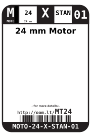
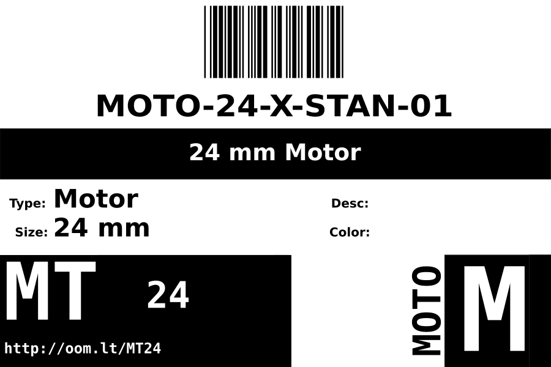
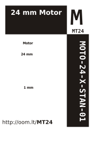

Contents
========

* [MOTO-24-X-STAN-01>24 mm Motor](#moto-24-x-stan-0124-mm-motor)
	* [Datasheets](#datasheets)
	* [Labels](#labels)
	* [EDA](#eda)
		* [Symbols](#symbols)
	* [Tags](#tags)

# MOTO-24-X-STAN-01>24 mm Motor

- ID: MOTO-24-X-STAN-01
- Name: MOTO-24-X-STAN-01

## Datasheets

- Datasheet: [datasheet.pdf](datasheet.pdf)

## Labels
  
  

|Front|Inventory|Specifications|
| :---: | :---: | :---: |
||||

## EDA

### Symbols

## Tags

- hexID: MT24
- oompSort: MOTO24STAN
- oompType: MOTO
- oompSize: 24
- oompColor: X
- oompDesc: STAN
- oompIndex: 01
- oompVersion: 98
- ooDiameter: 24 mm
- ooLength: 30.5 mm
- ooNumPins: 2
- ooDesignator: M
