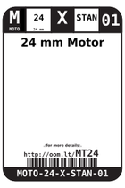

Contents
========

* [MT24 > 24 mm Motor](#mt24--24-mm-motor)
	* [Datasheets](#datasheets)
	* [Labels](#labels)
	* [EDA](#eda)
	* [Images](#images)
	* [Tags](#tags)

# MT24 > 24 mm Motor

- ID: MOTO-24-X-STAN-01
- Hex ID: MT24
- Name: 24 mm Motor
- Description: 24 mm Motor
- Long Link: [http://oom.lt/MOTO-24-X-STAN-01](http://oom.lt/MOTO-24-X-STAN-01)
- Long Link: [http://oom.lt/MT24](http://oom.lt/MT24)

## Datasheets

- Datasheet: [datasheet.pdf](datasheet.pdf)

## Labels
  
  

|label-front|label-inventory|label-spec|
| :---: | :---: | :---: |
||||

## EDA

### Symbols

## Images
  
  

|label-front|label-inventory|label-spec|
| :---: | :---: | :---: |
||||

## Tags

- oompID: MOTO-24-X-STAN-01
- name: 24 mm Motor
- hexID: MT24
- oompSort: MOTO24STAN
- oompType: MOTO
- oompSize: 24
- oompColor: X
- oompDesc: STAN
- oompIndex: 01
- oompVersion: 98
- ooDiameter: 24 mm
- ooLength: 30.5 mm
- ooNumPins: 2
- ooDesignator: M
