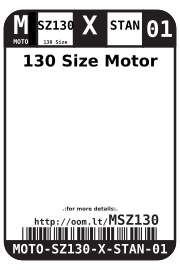
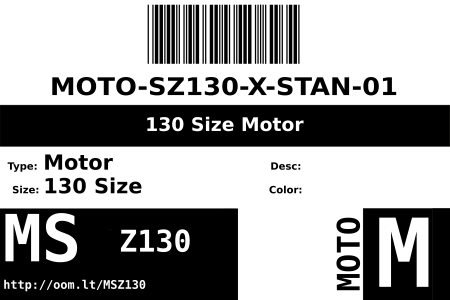
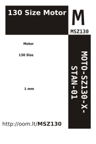

Contents
========

* [MOTO-SZ130-X-STAN-01>130 Size Motor](#moto-sz130-x-stan-01130-size-motor)
	* [Datasheets](#datasheets)
	* [Labels](#labels)
	* [EDA](#eda)
		* [Symbols](#symbols)
	* [Tags](#tags)

# MOTO-SZ130-X-STAN-01>130 Size Motor

- ID: MOTO-SZ130-X-STAN-01
- Name: MOTO-SZ130-X-STAN-01

## Datasheets

- Datasheet: [datasheet.pdf](datasheet.pdf)

## Labels
  
  

|label-front|label-inventory|label-spec|
| :---: | :---: | :---: |
||||

## EDA

### Symbols

## Tags

- oompType: MOTO
- oompSize: SZ130
- oompColor: X
- oompDesc: STAN
- oompIndex: 01
- hexID: MSZ130
- oompID: MOTO-SZ130-X-STAN-01
