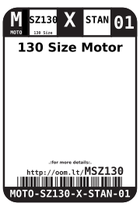

Contents
========

* [MSZ130 > ](#msz130--)
	* [Datasheets](#datasheets)
	* [Labels](#labels)
	* [EDA](#eda)
	* [Images](#images)
	* [Tags](#tags)

# MSZ130 > 

- ID: MOTO-SZ130-X-STAN-01
- Hex ID: MSZ130
- Name: 
- Description: 
- Long Link: [http://oom.lt/MOTO-SZ130-X-STAN-01](http://oom.lt/MOTO-SZ130-X-STAN-01)
- Short Link: [http://oom.lt/MSZ130](http://oom.lt/MSZ130)

## Datasheets

- Datasheet: [datasheet.pdf](datasheet.pdf)

## Labels
  
  

|label-front|label-inventory|label-spec|
| :---: | :---: | :---: |
||||

## EDA

## Images
  
  

|label-front|label-inventory|label-spec|
| :---: | :---: | :---: |
||||

## Tags

- oompType: MOTO
- oompSize: SZ130
- oompColor: X
- oompDesc: STAN
- oompIndex: 01
- hexID: MSZ130
- oompID: MOTO-SZ130-X-STAN-01
