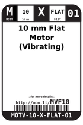

Contents
========

* [MVF10 > ](#mvf10--)
	* [Labels](#labels)
	* [EDA](#eda)
	* [Images](#images)
	* [Tags](#tags)

# MVF10 > 

- ID: MOTV-10-X-FLAT-01
- Hex ID: MVF10
- Name: 
- Description: 
- Long Link: [http://oom.lt/MOTV-10-X-FLAT-01](http://oom.lt/MOTV-10-X-FLAT-01)
- Short Link: [http://oom.lt/MVF10](http://oom.lt/MVF10)

## Labels
  
  

|label-front|label-inventory|label-spec|
| :---: | :---: | :---: |
||||

## EDA

## Images
  
  

|label-front|label-inventory|label-spec|
| :---: | :---: | :---: |
||||

## Tags

- oompType: MOTV
- oompSize: 10
- oompColor: X
- oompDesc: FLAT
- oompIndex: 01
- hexID: MVF10
- oompID: MOTV-10-X-FLAT-01
