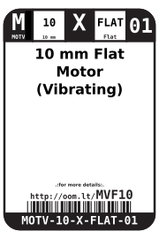
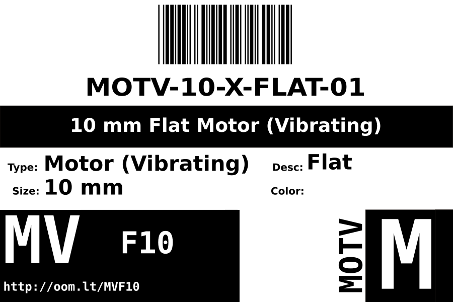
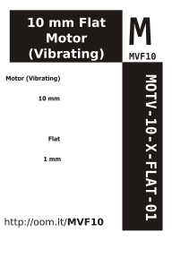

Contents
========

* [MOTV-10-X-FLAT-01>10 mm Flat Motor (Vibrating)](#motv-10-x-flat-0110-mm-flat-motor-vibrating)
	* [Labels](#labels)
	* [EDA](#eda)
		* [Symbols](#symbols)
	* [Tags](#tags)

# MOTV-10-X-FLAT-01>10 mm Flat Motor (Vibrating)

- ID: MOTV-10-X-FLAT-01
- Name: MOTV-10-X-FLAT-01

## Labels
  
  

|label-front|label-inventory|label-spec|
| :---: | :---: | :---: |
||||

## EDA

### Symbols

## Tags

- oompType: MOTV
- oompSize: 10
- oompColor: X
- oompDesc: FLAT
- oompIndex: 01
- hexID: MVF10
