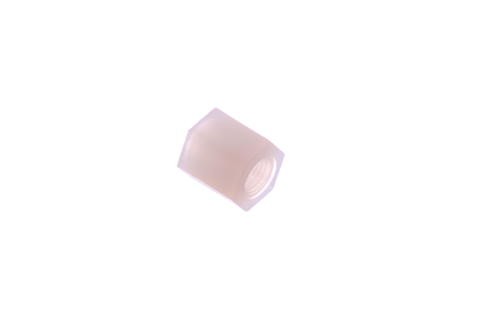
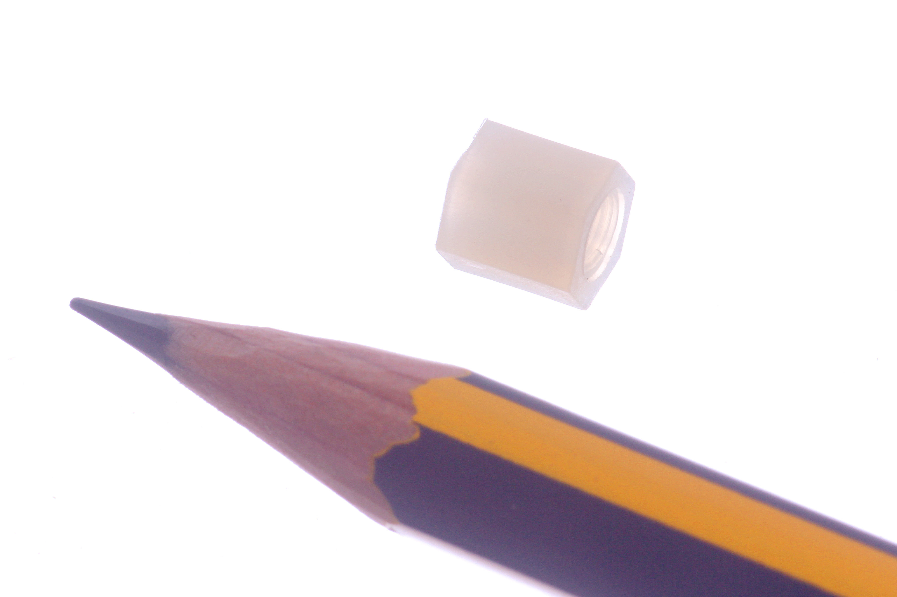

Contents
========

* [NHFF-M3-X-06-01>M3 x 6 mm Nylon Standoff (F-F)](#nhff-m3-x-06-01m3-x-6-mm-nylon-standoff-f-f)
	* [Images](#images)
	* [Datasheets](#datasheets)
	* [EDA](#eda)
		* [Footprints](#footprints)
		* [Symbols](#symbols)
	* [Tags](#tags)

# NHFF-M3-X-06-01>M3 x 6 mm Nylon Standoff (F-F)

- ID: NHFF-M3-X-06-01
- Name: NHFF-M3-X-06-01

## Images
  
  

|Main|Reference|
| :---: | :---: |
|||

## Datasheets

- Datasheet: [datasheet.pdf](datasheet.pdf)

## EDA

### Footprints
  

|||||
| :---: | :---: | :---: | :---: |

### Symbols

## Tags

- index: 408
- index: 4193
- oompID: NHFF-M3-X-06-01
- name: M3 x 6 mm Nylon Standoff (F-F)
- hexID: NFF06
- oompSort: M3M306
- oompType: NHFF
- oompSize: M3
- oompColor: X
- oompDesc: 06
- oompIndex: 01
- oompVersion: 31
- oompClass: Hardware
- oompClassCode: HARD
