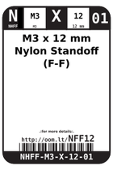
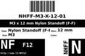
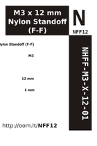

Contents
========

* [NFF12 > M3 x 12 mm Nylon Standoff (F-F)](#nff12--m3-x-12-mm-nylon-standoff-f-f)
	* [Datasheets](#datasheets)
	* [Labels](#labels)
	* [EDA](#eda)
	* [Images](#images)
	* [Tags](#tags)
  
![][im]
# NFF12 > M3 x 12 mm Nylon Standoff (F-F)

- ID: NHFF-M3-X-12-01
- Hex ID: NFF12
- Name: M3 x 12 mm Nylon Standoff (F-F)
- Description: M3 x 12 mm Nylon Standoff (F-F)
- Long Link: [http://oom.lt/NHFF-M3-X-12-01](http://oom.lt/NHFF-M3-X-12-01)
- Long Link: [http://oom.lt/NFF12](http://oom.lt/NFF12)

## Datasheets

- Datasheet: [datasheet.pdf](datasheet.pdf)

## Labels
  
  

|label-front|label-inventory|label-spec|
| :---: | :---: | :---: |
||||

## EDA

### Symbols

## Images
  
  

|image|image_RE|label-front|label-inventory|label-spec|
| :---: | :---: | :---: | :---: | :---: |
||||||

## Tags

- oompID: NHFF-M3-X-12-01
- name: M3 x 12 mm Nylon Standoff (F-F)
- hexID: NFF12
- oompSort: M3M312
- oompType: NHFF
- oompSize: M3
- oompColor: X
- oompDesc: 12
- oompIndex: 01
- oompVersion: 31
- oompClass: Hardware
- oompClassCode: HARD

[im]: image_450.jpg
