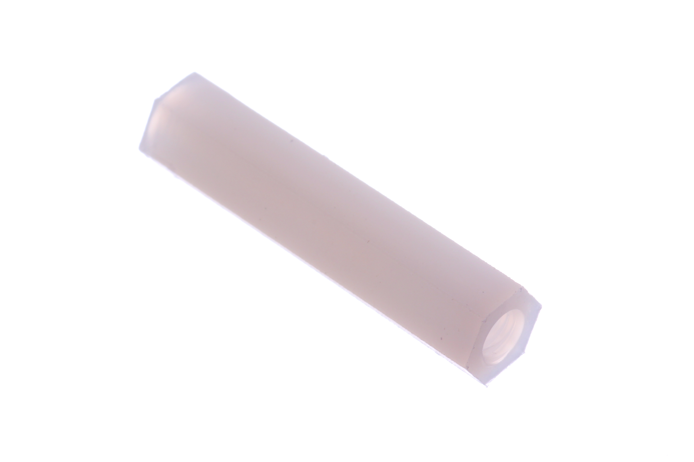
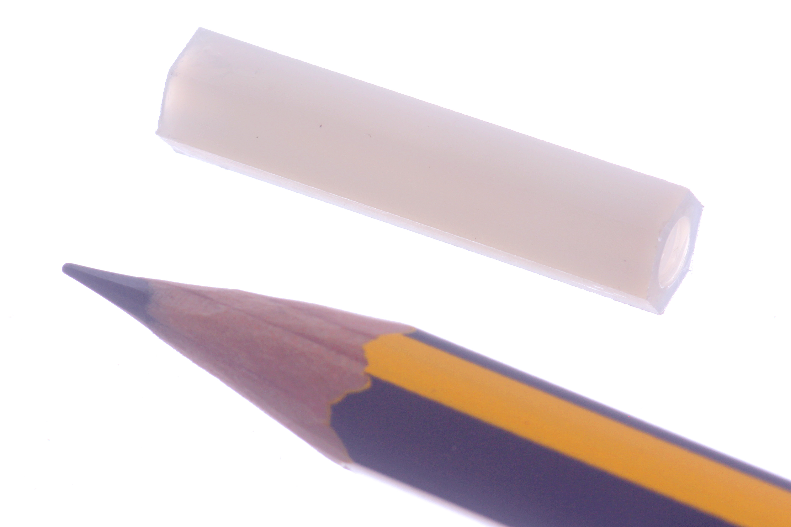

Contents
========

* [NHFF-M3-X-25-01>M3 x 25 mm Nylon Standoff (F-F)](#nhff-m3-x-25-01m3-x-25-mm-nylon-standoff-f-f)
	* [Images](#images)
	* [Datasheets](#datasheets)
	* [EDA](#eda)
		* [Symbols](#symbols)
	* [Tags](#tags)
  
![][im]
# NHFF-M3-X-25-01>M3 x 25 mm Nylon Standoff (F-F)

- ID: NHFF-M3-X-25-01
- Name: NHFF-M3-X-25-01

## Images
  
  

|Main|Reference|
| :---: | :---: |
|||

## Datasheets

- Datasheet: [datasheet.pdf](datasheet.pdf)

## EDA

### Symbols

## Tags

- index: 412
- index: 4197
- oompID: NHFF-M3-X-25-01
- name: M3 x 25 mm Nylon Standoff (F-F)
- hexID: NFF25
- oompSort: M3M325
- oompType: NHFF
- oompSize: M3
- oompColor: X
- oompDesc: 25
- oompIndex: 01
- oompVersion: 31
- oompClass: Hardware
- oompClassCode: HARD

[im]: image_600.jpg
