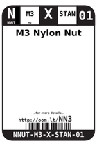
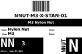
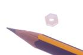

Contents
========

* [NN3 > M3 Nylon Nut](#nn3--m3-nylon-nut)
	* [Datasheets](#datasheets)
	* [Labels](#labels)
	* [EDA](#eda)
	* [Images](#images)
	* [Tags](#tags)
  
![][im]
# NN3 > M3 Nylon Nut

- ID: NNUT-M3-X-STAN-01
- Hex ID: NN3
- Name: M3 Nylon Nut
- Description: M3 Nylon Nut
- Long Link: [http://oom.lt/NNUT-M3-X-STAN-01](http://oom.lt/NNUT-M3-X-STAN-01)
- Short Link: [http://oom.lt/NN3](http://oom.lt/NN3)

## Datasheets

- Datasheet: [datasheet.pdf](datasheet.pdf)

## Labels
  
  

|label-front|label-inventory|label-spec|
| :---: | :---: | :---: |
||||

## EDA

### Symbols

## Images
  
  

|image|image_RE|label-front|label-inventory|label-spec|
| :---: | :---: | :---: | :---: | :---: |
||||||

## Tags

- oompID: NNUT-M3-X-STAN-01
- name: M3 Nylon Nut
- hexID: NN3
- oompSort: M3M3
- oompType: NNUT
- oompSize: M3
- oompColor: X
- oompDesc: STAN
- oompIndex: 01
- oompVersion: 31
- oompClass: Hardware
- oompClassCode: HARD

[im]: image_450.jpg
