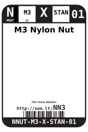

Contents
========

* [NNUT-M3-X-STAN-01>M3 Nylon Nut](#nnut-m3-x-stan-01m3-nylon-nut)
	* [Images](#images)
	* [Datasheets](#datasheets)
	* [Labels](#labels)
	* [EDA](#eda)
		* [Symbols](#symbols)
	* [Tags](#tags)
  
![][im]
# NNUT-M3-X-STAN-01>M3 Nylon Nut

- ID: NNUT-M3-X-STAN-01
- Name: NNUT-M3-X-STAN-01

## Images
  
  

|image|image_RE|
| :---: | :---: |
|||

## Datasheets

- Datasheet: [datasheet.pdf](datasheet.pdf)

## Labels
  
  

|label-front|label-inventory|label-spec|
| :---: | :---: | :---: |
||||

## EDA

### Symbols

## Tags

- oompID: NNUT-M3-X-STAN-01
- name: M3 Nylon Nut
- hexID: NN3
- oompSort: M3M3
- oompType: NNUT
- oompSize: M3
- oompColor: X
- oompDesc: STAN
- oompIndex: 01
- oompVersion: 31
- oompClass: Hardware
- oompClassCode: HARD

[im]: image_600.jpg
