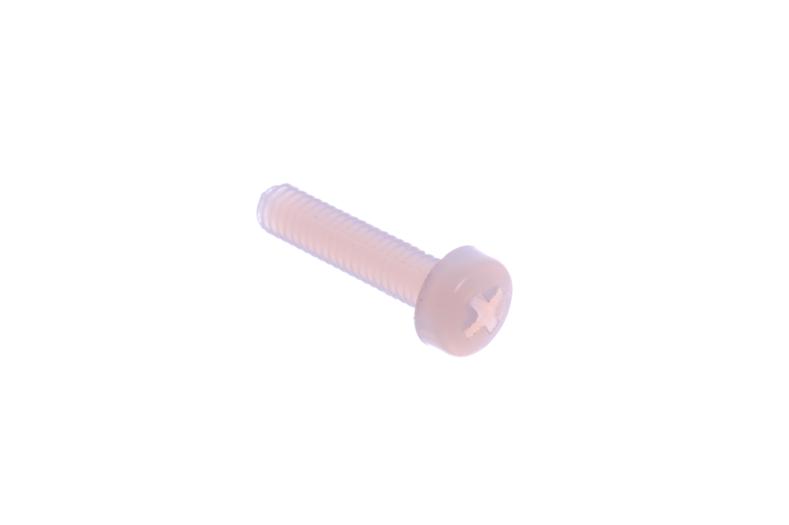
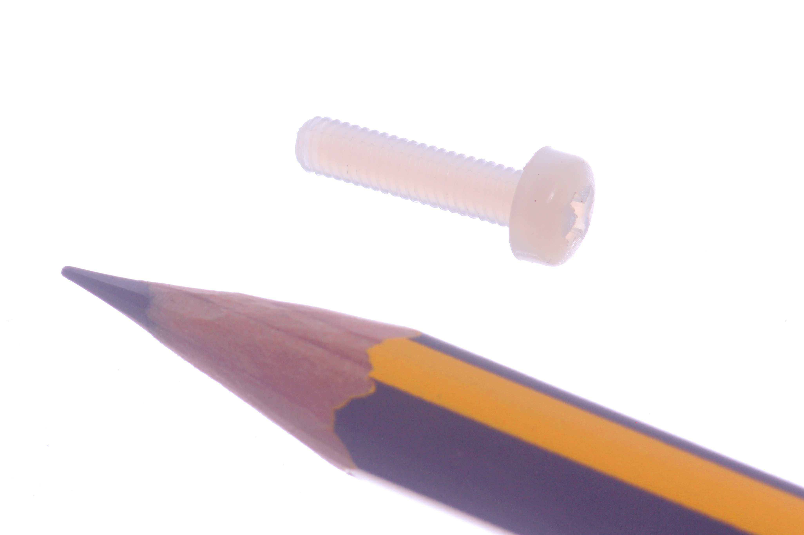

Contents
========

* [NSCR-M3-X-12-70>M3 x 12 mm Nylon Screw Cross Head](#nscr-m3-x-12-70m3-x-12-mm-nylon-screw-cross-head)
	* [Images](#images)
	* [Datasheets](#datasheets)
	* [EDA](#eda)
		* [Footprints](#footprints)
		* [Symbols](#symbols)
	* [Tags](#tags)
  
![][im]
# NSCR-M3-X-12-70>M3 x 12 mm Nylon Screw Cross Head

- ID: NSCR-M3-X-12-70
- Name: NSCR-M3-X-12-70

## Images
  
  

|Main|Reference|
| :---: | :---: |
|||

## Datasheets

- Datasheet: [datasheet.pdf](datasheet.pdf)

## EDA

### Footprints
  

|||||
| :---: | :---: | :---: | :---: |

### Symbols

## Tags

- index: 415
- index: 4208
- oompID: NSCR-M3-X-12-70
- name: M3 x 12 mm Nylon Screw Cross Head
- hexID: NS12
- oompSort: M3M312
- oompType: NSCR
- oompSize: M3
- oompColor: X
- oompDesc: 12
- oompIndex: 70
- oompVersion: 31
- oompClass: Hardware
- oompClassCode: HARD

[im]: image_600.jpg
