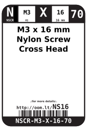

Contents
========

* [NSCR-M3-X-16-70>M3 x 16 mm Nylon Screw Cross Head](#nscr-m3-x-16-70m3-x-16-mm-nylon-screw-cross-head)
	* [Images](#images)
	* [Datasheets](#datasheets)
	* [Labels](#labels)
	* [EDA](#eda)
		* [Symbols](#symbols)
	* [Tags](#tags)
  
![][im]
# NSCR-M3-X-16-70>M3 x 16 mm Nylon Screw Cross Head

- ID: NSCR-M3-X-16-70
- Name: NSCR-M3-X-16-70

## Images
  
  

|image|image_RE|
| :---: | :---: |
|||

## Datasheets

- Datasheet: [datasheet.pdf](datasheet.pdf)

## Labels
  
  

|label-front|label-inventory|label-spec|
| :---: | :---: | :---: |
||||

## EDA

### Symbols

## Tags

- oompID: NSCR-M3-X-16-70
- name: M3 x 16 mm Nylon Screw Cross Head
- hexID: NS16
- oompSort: M3M316
- oompType: NSCR
- oompSize: M3
- oompColor: X
- oompDesc: 16
- oompIndex: 70
- oompVersion: 31
- oompClass: Hardware
- oompClassCode: HARD

[im]: image_600.jpg
