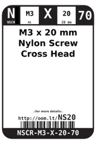
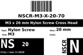
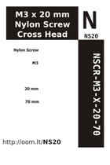
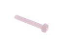

Contents
========

* [NS20 > M3 x 20 mm Nylon Screw Cross Head](#ns20--m3-x-20-mm-nylon-screw-cross-head)
	* [Datasheets](#datasheets)
	* [Labels](#labels)
	* [EDA](#eda)
	* [Images](#images)
	* [Tags](#tags)
  
![][im]
# NS20 > M3 x 20 mm Nylon Screw Cross Head

- ID: NSCR-M3-X-20-70
- Hex ID: NS20
- Name: M3 x 20 mm Nylon Screw Cross Head
- Description: M3 x 20 mm Nylon Screw Cross Head
- Long Link: [http://oom.lt/NSCR-M3-X-20-70](http://oom.lt/NSCR-M3-X-20-70)
- Short Link: [http://oom.lt/NS20](http://oom.lt/NS20)

## Datasheets

- Datasheet: [datasheet.pdf](datasheet.pdf)

## Labels
  
  

|label-front|label-inventory|label-spec|
| :---: | :---: | :---: |
||||

## EDA

### Symbols

## Images
  
  

|image|image_RE|label-front|label-inventory|label-spec|
| :---: | :---: | :---: | :---: | :---: |
||||||

## Tags

- oompID: NSCR-M3-X-20-70
- name: M3 x 20 mm Nylon Screw Cross Head
- hexID: NS20
- oompSort: M3M320
- oompType: NSCR
- oompSize: M3
- oompColor: X
- oompDesc: 20
- oompIndex: 70
- oompVersion: 31
- oompClass: Hardware
- oompClassCode: HARD

[im]: image_450.jpg
