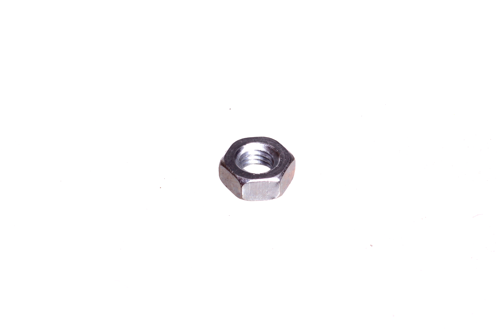
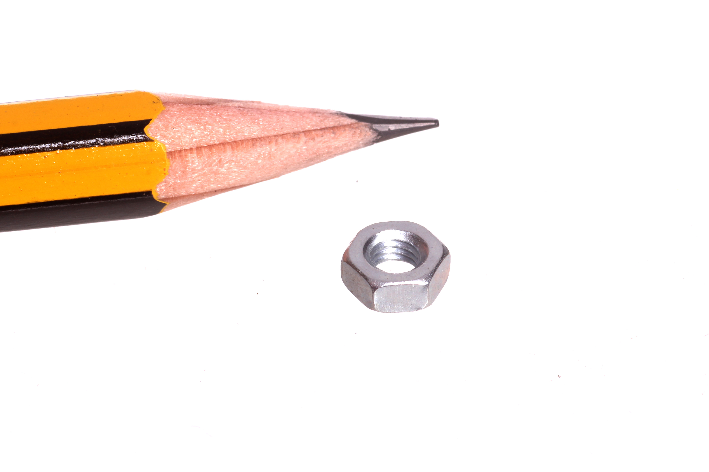

Contents
========

* [NUTT-M3-M-STAN-01>M3 Nut](#nutt-m3-m-stan-01m3-nut)
	* [Images](#images)
	* [Datasheets](#datasheets)
	* [EDA](#eda)
		* [Footprints](#footprints)
		* [Symbols](#symbols)
	* [Tags](#tags)

# NUTT-M3-M-STAN-01>M3 Nut

- ID: NUTT-M3-M-STAN-01
- Name: NUTT-M3-M-STAN-01

## Images
  
  

|Main|Reference|
| :---: | :---: |
|||

## Datasheets

- Datasheet: [datasheet.pdf](datasheet.pdf)

## EDA

### Footprints
  

|||||
| :---: | :---: | :---: | :---: |

### Symbols

## Tags

- index: 419
- index: 4213
- oompID: NUTT-M3-M-STAN-01
- name: M3 Nut
- hexID: NU3
- oompSort: M3M3
- oompType: NUTT
- oompSize: M3
- oompColor: M
- oompDesc: STAN
- oompIndex: 01
- oompVersion: 31
- oompClass: Hardware
- oompClassCode: HARD
