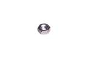

Contents
========

* [NU3 > M3 Nut](#nu3--m3-nut)
	* [Images](#images)
	* [Datasheets](#datasheets)
	* [Labels](#labels)
	* [EDA](#eda)
	* [Tags](#tags)
  
![][im]
# NU3 > M3 Nut

- ID: NUTT-M3-M-STAN-01
- Hex ID: NU3
- Name: M3 Nut
- Description: M3 Nut

## Images
  
  

|image|image_RE|label-front|label-inventory|label-spec|
| :---: | :---: | :---: | :---: | :---: |
||||||

## Datasheets

- Datasheet: [datasheet.pdf](datasheet.pdf)

## Labels
  
  

|label-front|label-inventory|label-spec|
| :---: | :---: | :---: |
||||

## EDA

### Symbols

## Tags

- oompID: NUTT-M3-M-STAN-01
- name: M3 Nut
- hexID: NU3
- oompSort: M3M3
- oompType: NUTT
- oompSize: M3
- oompColor: M
- oompDesc: STAN
- oompIndex: 01
- oompVersion: 31
- oompClass: Hardware
- oompClassCode: HARD

[im]: image_450.jpg
