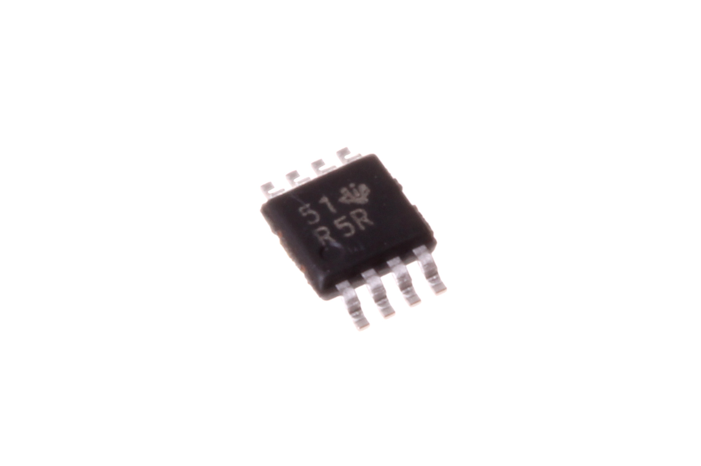
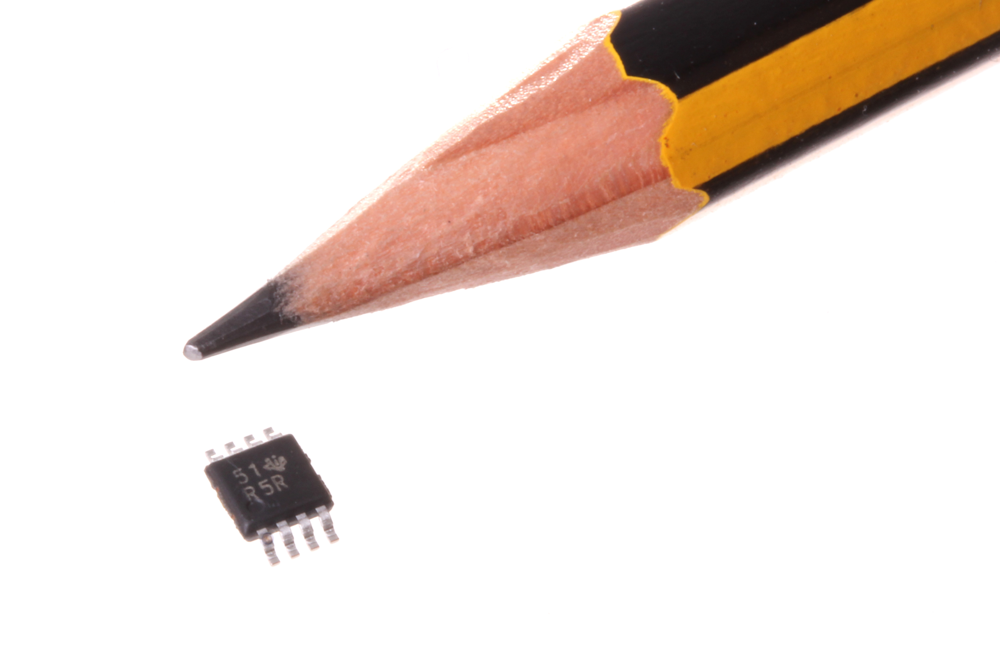
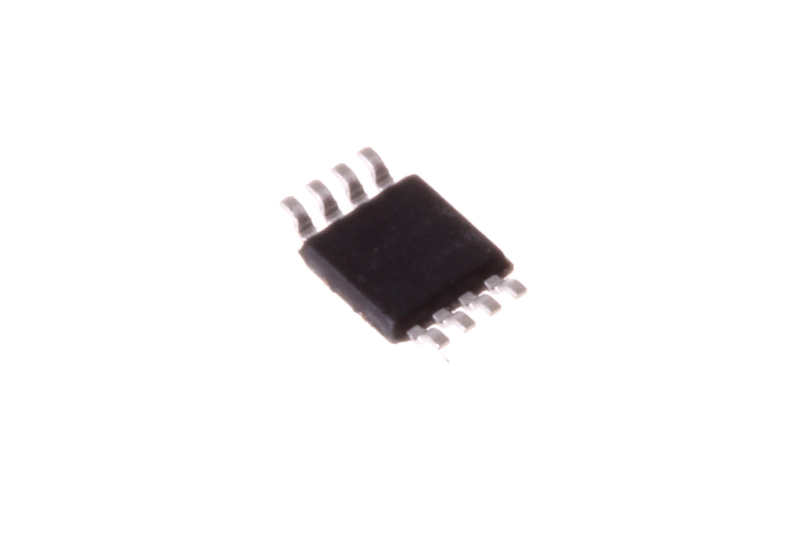
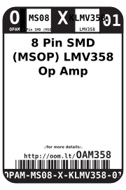
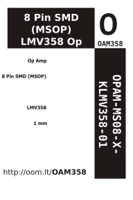

Contents
========

* [OPAM-MS08-X-KLMV358-01>8 Pin SMD (MSOP) LMV358 Op Amp](#opam-ms08-x-klmv358-018-pin-smd-msop-lmv358-op-amp)
	* [Images](#images)
	* [Datasheets](#datasheets)
	* [Labels](#labels)
	* [EDA](#eda)
		* [Symbols](#symbols)
	* [Tags](#tags)
  
![][im]
# OPAM-MS08-X-KLMV358-01>8 Pin SMD (MSOP) LMV358 Op Amp

- ID: OPAM-MS08-X-KLMV358-01
- Name: OPAM-MS08-X-KLMV358-01

## Images
  
  

|Main|Reference|Bottom|
| :---: | :---: | :---: |
||||

## Datasheets

- Datasheet: [datasheet.pdf](datasheet.pdf)

## Labels
  
  

|Front|Inventory|Specifications|
| :---: | :---: | :---: |
||||

## EDA

### Symbols

## Tags

- oompID: OPAM-MS08-X-KLMV358-01
- name: 8 Pin SMD (MSOP) LMV358 Op Amp
- hexID: OAM358
- oompSort: MS08LMV358
- oompType: OPAM
- oompSize: MS08
- oompColor: X
- oompDesc: KLMV358
- oompIndex: 01
- oompVersion: 99
- oompSkip: true
- ooWidth: 3 mm
- ooHeight: 1.1 mm
- ooLength: 4.9 mm
- com: SMD
- ooPackageMarking: R5#
- ooNumPins: 8
- oompClass: Surface Mount
- oompClassCode: SMDS
- ooDesignator: U1

[im]: image_600.jpg
