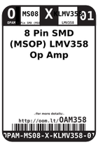
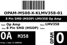
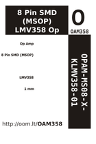
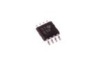
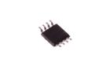

Contents
========

* [OAM358 > 8 Pin SMD (MSOP) LMV358 Op Amp](#oam358--8-pin-smd-msop-lmv358-op-amp)
	* [Datasheets](#datasheets)
	* [Labels](#labels)
	* [EDA](#eda)
	* [Images](#images)
	* [Tags](#tags)
  
![][im]
# OAM358 > 8 Pin SMD (MSOP) LMV358 Op Amp

- ID: OPAM-MS08-X-KLMV358-01
- Hex ID: OAM358
- Name: 8 Pin SMD (MSOP) LMV358 Op Amp
- Description: 8 Pin SMD (MSOP) LMV358 Op Amp
- Long Link: [http://oom.lt/OPAM-MS08-X-KLMV358-01](http://oom.lt/OPAM-MS08-X-KLMV358-01)
- Long Link: [http://oom.lt/OAM358](http://oom.lt/OAM358)

## Datasheets

- Datasheet: [datasheet.pdf](datasheet.pdf)

## Labels
  
  

|label-front|label-inventory|label-spec|
| :---: | :---: | :---: |
||||

## EDA

### Symbols

## Images
  
  

|image|image_RE|image_BOTTOM|label-front|label-inventory|label-spec|
| :---: | :---: | :---: | :---: | :---: | :---: |
|||||||

## Tags

- oompID: OPAM-MS08-X-KLMV358-01
- name: 8 Pin SMD (MSOP) LMV358 Op Amp
- hexID: OAM358
- oompSort: MS08LMV358
- oompType: OPAM
- oompSize: MS08
- oompColor: X
- oompDesc: KLMV358
- oompIndex: 01
- oompVersion: 99
- oompSkip: true
- ooWidth: 3 mm
- ooHeight: 1.1 mm
- ooLength: 4.9 mm
- com: SMD
- ooPackageMarking: R5#
- ooNumPins: 8
- oompClass: Surface Mount
- oompClassCode: SMDS
- ooDesignator: U1

[im]: image_450.jpg
