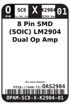
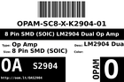
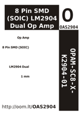
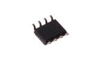

Contents
========

* [OAS2904 > 8 Pin SMD (SOIC) LM2904 Dual Op Amp](#oas2904--8-pin-smd-soic-lm2904-dual-op-amp)
	* [Datasheets](#datasheets)
	* [Labels](#labels)
	* [EDA](#eda)
	* [Images](#images)
	* [Tags](#tags)
  
![][im]
# OAS2904 > 8 Pin SMD (SOIC) LM2904 Dual Op Amp

- ID: OPAM-SC8-X-K2904-01
- Hex ID: OAS2904
- Name: 8 Pin SMD (SOIC) LM2904 Dual Op Amp
- Description: 8 Pin SMD (SOIC) LM2904 Dual Op Amp
- Long Link: [http://oom.lt/OPAM-SC8-X-K2904-01](http://oom.lt/OPAM-SC8-X-K2904-01)
- Short Link: [http://oom.lt/OAS2904](http://oom.lt/OAS2904)

## Datasheets

- Datasheet: [datasheet.pdf](datasheet.pdf)

## Labels
  
  

|label-front|label-inventory|label-spec|
| :---: | :---: | :---: |
||||

## EDA

### Symbols

## Images
  
  

|image|image_RE|image_BOTTOM|label-front|label-inventory|label-spec|
| :---: | :---: | :---: | :---: | :---: | :---: |
|||||||

## Tags

- oompID: OPAM-SC8-X-K2904-01
- name: 8 Pin SMD (SOIC) LM2904 Dual Op Amp
- hexID: OAS2904
- oompSort: 
- oompClass: Surface Mount
- oompClassCode: SMDS
- oompType: OPAM
- oompSize: SC8
- oompColor: X
- oompDesc: K2904
- oompIndex: 01
- oompVersion: 40
- ooDesignator: U1

[im]: image_450.jpg
