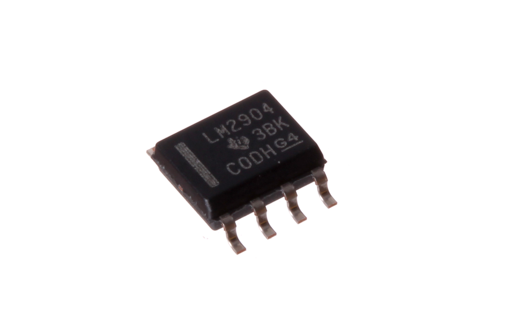
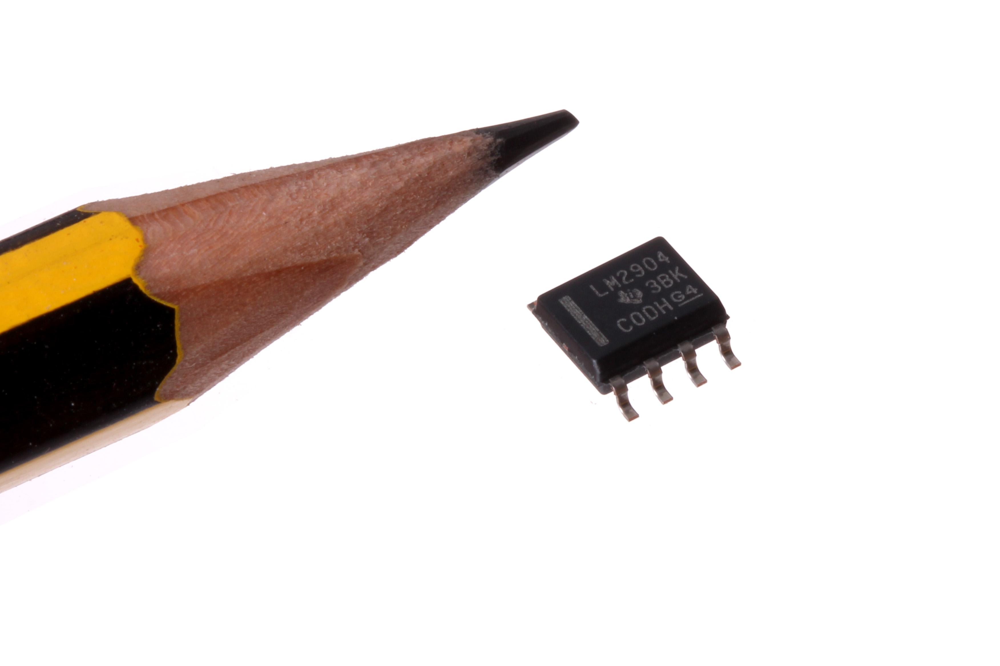
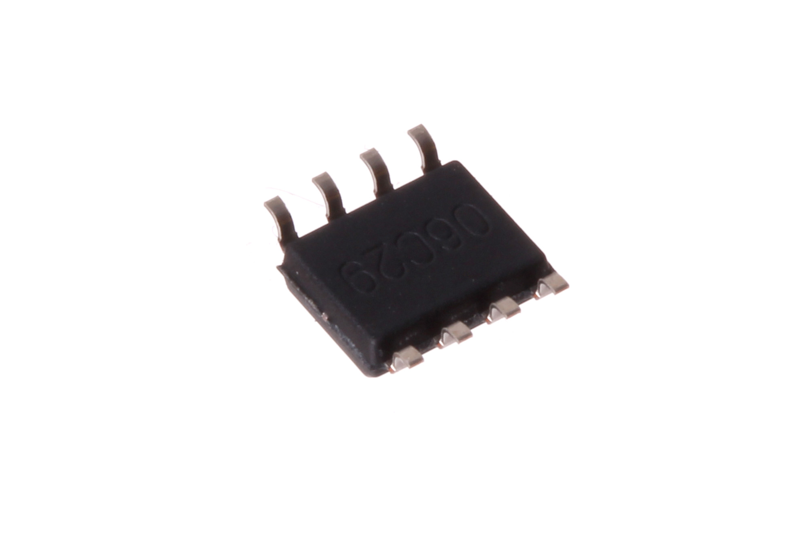

Contents
========

* [OPAM-SC8-X-K2904-01>8 Pin SMD (SOIC) LM2904 Dual Op Amp](#opam-sc8-x-k2904-018-pin-smd-soic-lm2904-dual-op-amp)
	* [Images](#images)
	* [Datasheets](#datasheets)
	* [EDA](#eda)
		* [Footprints](#footprints)
		* [Symbols](#symbols)
	* [Tags](#tags)

# OPAM-SC8-X-K2904-01>8 Pin SMD (SOIC) LM2904 Dual Op Amp

- ID: OPAM-SC8-X-K2904-01
- Name: OPAM-SC8-X-K2904-01

## Images
  
  

|Main|Reference|Bottom|
| :---: | :---: | :---: |
||||

## Datasheets

- Datasheet: [datasheet.pdf](datasheet.pdf)

## EDA

### Footprints
  

|||||
| :---: | :---: | :---: | :---: |

### Symbols

## Tags

- index: 422
- oompID: OPAM-SC8-X-K2904-01
- name: 8 Pin SMD (SOIC) LM2904 Dual Op Amp
- hexID: OAS2904
- oompSort: 
- oompClass: Surface Mount
- oompClassCode: SMDS
- oompType: OPAM
- oompSize: SC8
- oompColor: X
- oompDesc: K2904
- oompIndex: 01
- oompVersion: 40
- ooDesignator: U1
