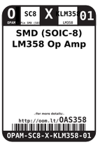
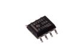
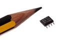
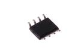

Contents
========

* [OAS358 > SMD (SOIC-8) LM358 Op Amp](#oas358--smd-soic-8-lm358-op-amp)
	* [Datasheets](#datasheets)
	* [Labels](#labels)
	* [EDA](#eda)
	* [Images](#images)
	* [Tags](#tags)
  
![][im]
# OAS358 > SMD (SOIC-8) LM358 Op Amp

- ID: OPAM-SC8-X-KLM358-01
- Hex ID: OAS358
- Name: SMD (SOIC-8) LM358 Op Amp
- Description: SMD (SOIC-8) LM358 Op Amp
- Long Link: [http://oom.lt/OPAM-SC8-X-KLM358-01](http://oom.lt/OPAM-SC8-X-KLM358-01)
- Short Link: [http://oom.lt/OAS358](http://oom.lt/OAS358)

## Datasheets

- Datasheet: [datasheet.pdf](datasheet.pdf)

## Labels
  
  

|label-front|label-inventory|label-spec|
| :---: | :---: | :---: |
||||

## EDA

### Symbols

## Images
  
  

|image|image_RE|image_BOTTOM|label-front|label-inventory|label-spec|
| :---: | :---: | :---: | :---: | :---: | :---: |
|||||||

## Tags

- oompID: OPAM-SC8-X-KLM358-01
- name: SMD (SOIC-8) LM358 Op Amp
- hexID: OAS358
- oompSort: 
- oompClass: Surface Mount
- oompClassCode: SMDS
- oompType: OPAM
- oompSize: SC8
- oompColor: X
- oompDesc: KLM358
- oompIndex: 01
- oompVersion: 40
- ooDesignator: U1

[im]: image_450.jpg
