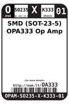

Contents
========

* [OA333 > SMD (SOT-23-5) OPA333 Op Amp](#oa333--smd-sot-23-5-opa333-op-amp)
	* [Datasheets](#datasheets)
	* [Labels](#labels)
	* [EDA](#eda)
	* [Images](#images)
	* [Tags](#tags)

# OA333 > SMD (SOT-23-5) OPA333 Op Amp

- ID: OPAM-SO235-X-K333-01
- Hex ID: OA333
- Name: SMD (SOT-23-5) OPA333 Op Amp
- Description: SMD (SOT-23-5) OPA333 Op Amp
- Long Link: [http://oom.lt/OPAM-SO235-X-K333-01](http://oom.lt/OPAM-SO235-X-K333-01)
- Long Link: [http://oom.lt/OA333](http://oom.lt/OA333)

## Datasheets

- Datasheet: [datasheet.pdf](datasheet.pdf)

## Labels
  
  

|label-front|label-inventory|label-spec|
| :---: | :---: | :---: |
||||

## EDA

### Symbols

## Images
  
  

|label-front|label-inventory|label-spec|
| :---: | :---: | :---: |
||||

## Tags

- oompID: OPAM-SO235-X-K333-01
- name: SMD (SOT-23-5) OPA333 Op Amp
- hexID: OA333
- oompSort: OPAMSO235K333
- oompType: OPAM
- oompSize: SO235
- oompColor: X
- oompDesc: K333
- oompIndex: 01
- oompVersion: 98
- ooDesignator: U1
