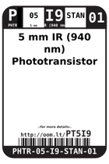
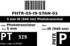
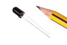

Contents
========

* [PT5I9 > 5 mm IR (940 nm) Phototransistor](#pt5i9--5-mm-ir-940-nm-phototransistor)
	* [Diagrams](#diagrams)
	* [Datasheets](#datasheets)
	* [Labels](#labels)
	* [EDA](#eda)
	* [Images](#images)
	* [Tags](#tags)
  
![][im]
# PT5I9 > 5 mm IR (940 nm) Phototransistor

- ID: PHTR-05-I9-STAN-01
- Hex ID: PT5I9
- Name: 5 mm IR (940 nm) Phototransistor
- Description: 5 mm IR (940 nm) Phototransistor
- Long Link: [http://oom.lt/PHTR-05-I9-STAN-01](http://oom.lt/PHTR-05-I9-STAN-01)
- Short Link: [http://oom.lt/PT5I9](http://oom.lt/PT5I9)

## Diagrams
  
  

|diagBBLS|diagDIAG|diagIDEN|diagSCHEM|diagSIMP|
| :---: | :---: | :---: | :---: | :---: |
||||||

## Datasheets

- Datasheet: [datasheet.pdf](datasheet.pdf)

## Labels
  
  

|label-front|label-inventory|label-spec|
| :---: | :---: | :---: |
||||

## EDA

### Symbols

## Images
  
  

|image|image_RE|diagBBLS|diagDIAG|diagIDEN|diagSCHEM|diagSIMP|label-front|label-inventory|label-spec|
| :---: | :---: | :---: | :---: | :---: | :---: | :---: | :---: | :---: | :---: |
|||||||||||

## Tags

- oompID: PHTR-05-I9-STAN-01
- name: 5 mm IR (940 nm) Phototransistor
- hexID: PT5I9
- oompSort: 
- oompClass: Through Hole
- oompClassCode: THTH
- oompType: PHTR
- oompSize: 05
- oompColor: I9
- oompDesc: STAN
- oompIndex: 01
- oompVersion: 40
- ooDesignator: Q1

[im]: image_450.jpg
