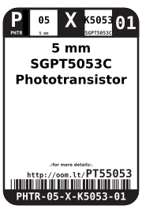
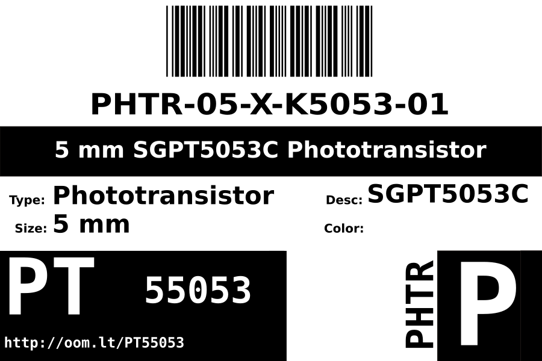

Contents
========

* [PHTR-05-X-K5053-01>5 mm SGPT5053C Phototransistor](#phtr-05-x-k5053-015-mm-sgpt5053c-phototransistor)
	* [Datasheets](#datasheets)
	* [Labels](#labels)
	* [EDA](#eda)
		* [Symbols](#symbols)
	* [Tags](#tags)

# PHTR-05-X-K5053-01>5 mm SGPT5053C Phototransistor

- ID: PHTR-05-X-K5053-01
- Name: PHTR-05-X-K5053-01

## Datasheets

- Datasheet: [datasheet.pdf](datasheet.pdf)

## Labels
  
  

|label-front|label-inventory|label-spec|
| :---: | :---: | :---: |
||||

## EDA

### Symbols

## Tags

- oompType: PHTR
- oompSize: 05
- oompColor: X
- oompDesc: K5053
- oompIndex: 01
- hexID: PT55053
