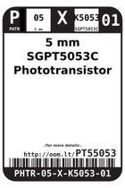
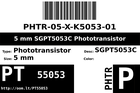
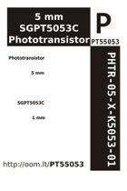

Contents
========

* [PT55053 > 5 mm SGPT5053C Phototransistor](#pt55053--5-mm-sgpt5053c-phototransistor)
	* [Datasheets](#datasheets)
	* [Labels](#labels)
	* [EDA](#eda)
	* [Images](#images)
	* [Tags](#tags)

# PT55053 > 5 mm SGPT5053C Phototransistor

- ID: PHTR-05-X-K5053-01
- Hex ID: PT55053
- Name: 5 mm SGPT5053C Phototransistor
- Description: 5 mm SGPT5053C Phototransistor
- Long Link: [http://oom.lt/PHTR-05-X-K5053-01](http://oom.lt/PHTR-05-X-K5053-01)
- Short Link: [http://oom.lt/PT55053](http://oom.lt/PT55053)

## Datasheets

- Datasheet: [datasheet.pdf](datasheet.pdf)

## Labels
  
  

|label-front|label-inventory|label-spec|
| :---: | :---: | :---: |
||||

## EDA

## Images
  
  

|label-front|label-inventory|label-spec|
| :---: | :---: | :---: |
||||

## Tags

- oompType: PHTR
- oompSize: 05
- oompColor: X
- oompDesc: K5053
- oompIndex: 01
- hexID: PT55053
- oompID: PHTR-05-X-K5053-01
