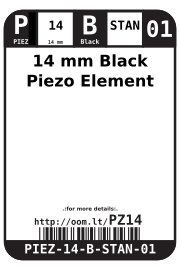
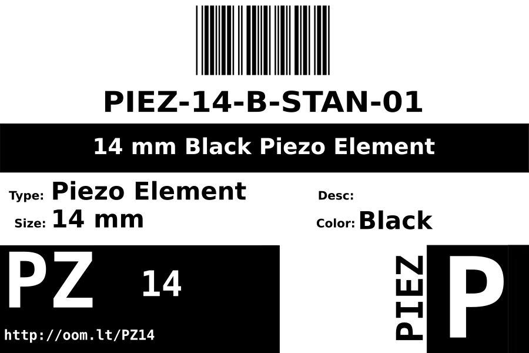
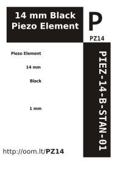

Contents
========

* [PIEZ-14-B-STAN-01>14 mm Black Piezo Element](#piez-14-b-stan-0114-mm-black-piezo-element)
	* [Datasheets](#datasheets)
	* [Labels](#labels)
	* [EDA](#eda)
		* [Symbols](#symbols)
	* [Tags](#tags)

# PIEZ-14-B-STAN-01>14 mm Black Piezo Element

- ID: PIEZ-14-B-STAN-01
- Name: PIEZ-14-B-STAN-01

## Datasheets

- Datasheet: [datasheet.pdf](datasheet.pdf)

## Labels
  
  

|label-front|label-inventory|label-spec|
| :---: | :---: | :---: |
||||

## EDA

### Symbols

## Tags

- oompType: PIEZ
- oompSize: 14
- oompColor: B
- oompDesc: STAN
- oompIndex: 01
- manufacturersPartNumber: TDK,PS1420P02CT
- manufacturersPartNumber: Sweet Sound,PSE1470+4005PA
- ooPitch: 5
- hexID: PZ14
- oompID: PIEZ-14-B-STAN-01
