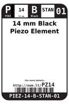

Contents
========

* [PZ14 > 14 mm Black Piezo Element](#pz14--14-mm-black-piezo-element)
	* [Images](#images)
	* [Datasheets](#datasheets)
	* [Labels](#labels)
	* [EDA](#eda)
	* [Tags](#tags)

# PZ14 > 14 mm Black Piezo Element

- ID: PIEZ-14-B-STAN-01
- Hex ID: PZ14
- Name: 14 mm Black Piezo Element
- Description: 14 mm Black Piezo Element

## Images
  
  

|label-front|label-inventory|label-spec|
| :---: | :---: | :---: |
||||

## Datasheets

- Datasheet: [datasheet.pdf](datasheet.pdf)

## Labels
  
  

|label-front|label-inventory|label-spec|
| :---: | :---: | :---: |
||||

## EDA

### Symbols

## Tags

- oompType: PIEZ
- oompSize: 14
- oompColor: B
- oompDesc: STAN
- oompIndex: 01
- manufacturersPartNumber: TDK,PS1420P02CT
- manufacturersPartNumber: Sweet Sound,PSE1470+4005PA
- ooPitch: 5
- hexID: PZ14
- oompID: PIEZ-14-B-STAN-01
