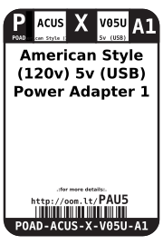
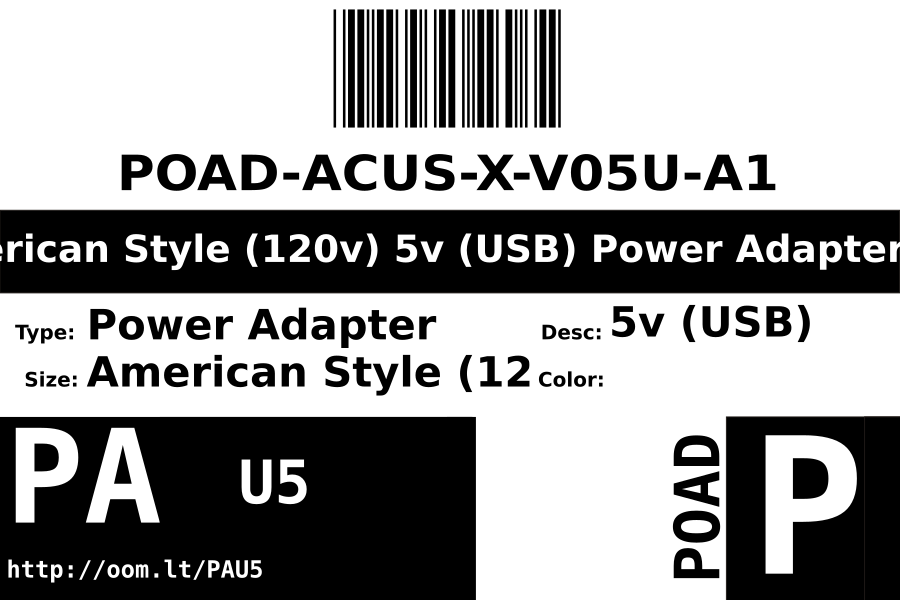

Contents
========

* [POAD-ACUS-X-V05U-A1>American Style (120v) 5v (USB) Power Adapter 1 A](#poad-acus-x-v05u-a1american-style-120v-5v-usb-power-adapter-1-a)
	* [Datasheets](#datasheets)
	* [Labels](#labels)
	* [EDA](#eda)
		* [Symbols](#symbols)
	* [Tags](#tags)

# POAD-ACUS-X-V05U-A1>American Style (120v) 5v (USB) Power Adapter 1 A

- ID: POAD-ACUS-X-V05U-A1
- Name: POAD-ACUS-X-V05U-A1

## Datasheets

- Datasheet: [datasheet.pdf](datasheet.pdf)

## Labels
  
  

|label-front|label-inventory|label-spec|
| :---: | :---: | :---: |
||||

## EDA

### Symbols

## Tags

- oompID: POAD-ACUS-X-V05U-A1
- name: American Style (120v) 5v (USB) Power Adapter 1 A
- hexID: PAU5
- oompSort: POAD0501
- oompType: POAD
- oompSize: ACUS
- oompColor: X
- oompDesc: V05U
- oompIndex: A1
- oompVersion: 98
