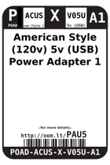
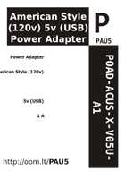

Contents
========

* [PAU5 > American Style (120v) 5v (USB) Power Adapter 1 A](#pau5--american-style-120v-5v-usb-power-adapter-1-a)
	* [Datasheets](#datasheets)
	* [Labels](#labels)
	* [EDA](#eda)
	* [Images](#images)
	* [Tags](#tags)

# PAU5 > American Style (120v) 5v (USB) Power Adapter 1 A

- ID: POAD-ACUS-X-V05U-A1
- Hex ID: PAU5
- Name: American Style (120v) 5v (USB) Power Adapter 1 A
- Description: American Style (120v) 5v (USB) Power Adapter 1 A
- Long Link: [http://oom.lt/POAD-ACUS-X-V05U-A1](http://oom.lt/POAD-ACUS-X-V05U-A1)
- Short Link: [http://oom.lt/PAU5](http://oom.lt/PAU5)

## Datasheets

- Datasheet: [datasheet.pdf](datasheet.pdf)

## Labels
  
  

|label-front|label-inventory|label-spec|
| :---: | :---: | :---: |
||||

## EDA

### Symbols

## Images
  
  

|label-front|label-inventory|label-spec|
| :---: | :---: | :---: |
||||

## Tags

- oompID: POAD-ACUS-X-V05U-A1
- name: American Style (120v) 5v (USB) Power Adapter 1 A
- hexID: PAU5
- oompSort: POAD0501
- oompType: POAD
- oompSize: ACUS
- oompColor: X
- oompDesc: V05U
- oompIndex: A1
- oompVersion: 98
