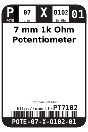

Contents
========

* [POTE-07-X-O102-01>7 mm 1k Ohm Potentiometer](#pote-07-x-o102-017-mm-1k-ohm-potentiometer)
	* [Datasheets](#datasheets)
	* [Labels](#labels)
	* [EDA](#eda)
		* [Symbols](#symbols)
	* [Tags](#tags)

# POTE-07-X-O102-01>7 mm 1k Ohm Potentiometer

- ID: POTE-07-X-O102-01
- Name: POTE-07-X-O102-01

## Datasheets

- Datasheet: [datasheet.pdf](datasheet.pdf)

## Labels
  
  

|Front|Inventory|Specifications|
| :---: | :---: | :---: |
||||

## EDA

### Symbols

## Tags

- hexID: PT7102
- oompSort: POTE07O102
- oompType: POTE
- oompSize: 07
- oompColor: X
- oompDesc: O102
- oompIndex: 01
- oompVersion: 98
- ooWidth: 7 mm
- ooLength: 7 mm
- ooDesignator: VR1
