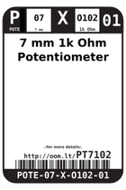
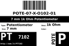
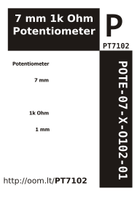

Contents
========

* [PT7102 > 7 mm 1k Ohm Potentiometer](#pt7102--7-mm-1k-ohm-potentiometer)
	* [Datasheets](#datasheets)
	* [Labels](#labels)
	* [EDA](#eda)
	* [Images](#images)
	* [Tags](#tags)

# PT7102 > 7 mm 1k Ohm Potentiometer

- ID: POTE-07-X-O102-01
- Hex ID: PT7102
- Name: 7 mm 1k Ohm Potentiometer
- Description: 7 mm 1k Ohm Potentiometer
- Long Link: [http://oom.lt/POTE-07-X-O102-01](http://oom.lt/POTE-07-X-O102-01)
- Short Link: [http://oom.lt/PT7102](http://oom.lt/PT7102)

## Datasheets

- Datasheet: [datasheet.pdf](datasheet.pdf)

## Labels
  
  

|label-front|label-inventory|label-spec|
| :---: | :---: | :---: |
||||

## EDA

### Symbols

## Images
  
  

|label-front|label-inventory|label-spec|
| :---: | :---: | :---: |
||||

## Tags

- oompID: POTE-07-X-O102-01
- name: 7 mm 1k Ohm Potentiometer
- hexID: PT7102
- oompSort: POTE07O102
- oompType: POTE
- oompSize: 07
- oompColor: X
- oompDesc: O102
- oompIndex: 01
- oompVersion: 98
- ooWidth: 7 mm
- ooLength: 7 mm
- ooDesignator: VR1
