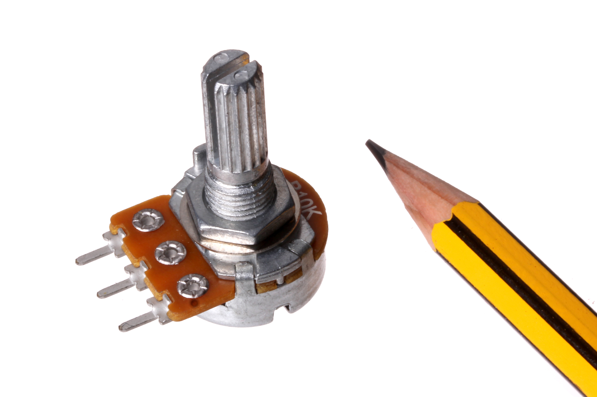

Contents
========

* [POTE-07-X-O103-01>7 mm 10k Ohm Potentiometer](#pote-07-x-o103-017-mm-10k-ohm-potentiometer)
	* [Images](#images)
	* [Datasheets](#datasheets)
	* [EDA](#eda)
		* [Symbols](#symbols)
	* [Tags](#tags)

# POTE-07-X-O103-01>7 mm 10k Ohm Potentiometer

- ID: POTE-07-X-O103-01
- Name: POTE-07-X-O103-01

## Images
  
  

|Reference|Bottom|
| :---: | :---: |
|||

## Datasheets

- Datasheet: [datasheet.pdf](datasheet.pdf)

## EDA

### Symbols

## Tags

- index: 428
- oompID: POTE-07-X-O103-01
- name: 7 mm 10k Ohm Potentiometer
- hexID: PT7103
- oompSort: 
- oompClass: Through Hole Component
- oompClassCode: THTH
- oompType: POTE
- oompSize: 07
- oompColor: X
- oompDesc: O103
- oompIndex: 01
- oompVersion: 40
- ooDesignator: VR1
