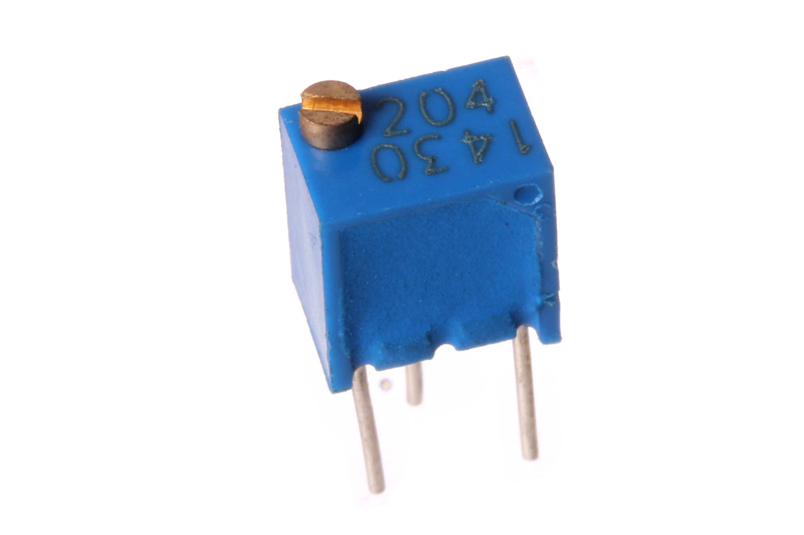
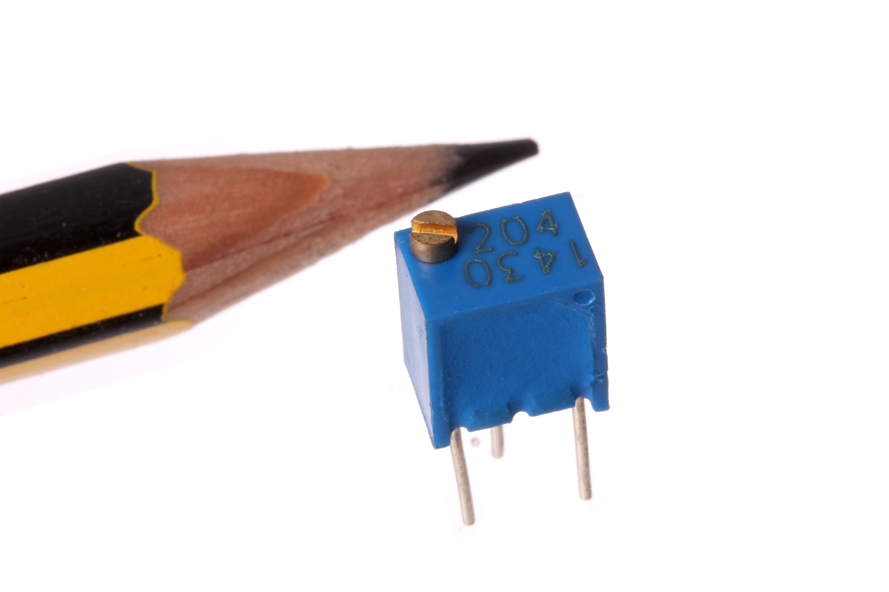

Contents
========

* [POTE-14-X-O204-68>14 mm 200k Ohm Potentiometer Side Adjust](#pote-14-x-o204-6814-mm-200k-ohm-potentiometer-side-adjust)
	* [Images](#images)
	* [Datasheets](#datasheets)
	* [Labels](#labels)
	* [EDA](#eda)
		* [Symbols](#symbols)
	* [Tags](#tags)
  
![][im]
# POTE-14-X-O204-68>14 mm 200k Ohm Potentiometer Side Adjust

- ID: POTE-14-X-O204-68
- Name: POTE-14-X-O204-68

## Images
  
  

|Main|Reference|Bottom|
| :---: | :---: | :---: |
||||

## Datasheets

- Datasheet: [datasheet.pdf](datasheet.pdf)

## Labels
  
  

|Front|Inventory|Specifications|
| :---: | :---: | :---: |
||||

## EDA

### Symbols

## Tags

- oompID: POTE-14-X-O204-68
- name: 14 mm 200k Ohm Potentiometer Side Adjust
- hexID: PT4204S
- oompSort: 
- oompClass: Through Hole Component
- oompClassCode: THTH
- oompType: POTE
- oompSize: 14
- oompColor: X
- oompDesc: O204
- oompIndex: 68
- oompVersion: 40
- ooDesignator: VR1

[im]: image_600.jpg
