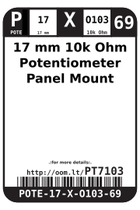
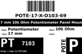
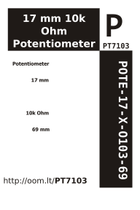

Contents
========

* [PT7103 > 17 mm 10k Ohm Potentiometer Panel Mount](#pt7103--17-mm-10k-ohm-potentiometer-panel-mount)
	* [Datasheets](#datasheets)
	* [Labels](#labels)
	* [EDA](#eda)
	* [Images](#images)
	* [Tags](#tags)
  
![][im]
# PT7103 > 17 mm 10k Ohm Potentiometer Panel Mount

- ID: POTE-17-X-O103-69
- Hex ID: PT7103
- Name: 17 mm 10k Ohm Potentiometer Panel Mount
- Description: 17 mm 10k Ohm Potentiometer Panel Mount
- Long Link: [http://oom.lt/POTE-17-X-O103-69](http://oom.lt/POTE-17-X-O103-69)
- Short Link: [http://oom.lt/PT7103](http://oom.lt/PT7103)

## Datasheets

- Datasheet: [datasheet.pdf](datasheet.pdf)

## Labels
  
  

|label-front|label-inventory|label-spec|
| :---: | :---: | :---: |
||||

## EDA

### Symbols

## Images
  
  

|image|label-front|label-inventory|label-spec|
| :---: | :---: | :---: | :---: |
|||||

## Tags

- oompID: POTE-17-X-O103-69
- name: 17 mm 10k Ohm Potentiometer Panel Mount
- hexID: PT7103
- oompSort: 
- oompClass: Through Hole Component
- oompClassCode: THTH
- oompType: POTE
- oompSize: 17
- oompColor: X
- oompDesc: O103
- oompIndex: 69
- oompVersion: 40
- ooDesignator: VR1

[im]: image_450.jpg
