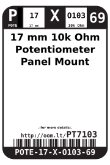

Contents
========

* [POTE-17-X-O103-69>17 mm 10k Ohm Potentiometer Panel Mount](#pote-17-x-o103-6917-mm-10k-ohm-potentiometer-panel-mount)
	* [Images](#images)
	* [Datasheets](#datasheets)
	* [Labels](#labels)
	* [EDA](#eda)
		* [Symbols](#symbols)
	* [Tags](#tags)
  
![][im]
# POTE-17-X-O103-69>17 mm 10k Ohm Potentiometer Panel Mount

- ID: POTE-17-X-O103-69
- Name: POTE-17-X-O103-69

## Images
  
  

|Main|
| :---: |
||

## Datasheets

- Datasheet: [datasheet.pdf](datasheet.pdf)

## Labels
  
  

|Front|Inventory|Specifications|
| :---: | :---: | :---: |
||||

## EDA

### Symbols

## Tags

- index: 12731
- oompID: POTE-17-X-O103-69
- name: 17 mm 10k Ohm Potentiometer Panel Mount
- hexID: PT7103
- oompSort: 
- oompClass: Through Hole Component
- oompClassCode: THTH
- oompType: POTE
- oompSize: 17
- oompColor: X
- oompDesc: O103
- oompIndex: 69
- oompVersion: 40
- ooDesignator: VR1

[im]: image_600.jpg
