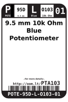
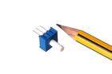
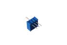

Contents
========

* [PTA103 > 9.5 mm 10k Ohm Blue Potentiometer](#pta103--95-mm-10k-ohm-blue-potentiometer)
	* [Diagrams](#diagrams)
	* [Datasheets](#datasheets)
	* [Labels](#labels)
	* [EDA](#eda)
	* [Images](#images)
	* [Tags](#tags)
  
![][im]
# PTA103 > 9.5 mm 10k Ohm Blue Potentiometer

- ID: POTE-95D-L-O103-01
- Hex ID: PTA103
- Name: 9.5 mm 10k Ohm Blue Potentiometer
- Description: 9.5 mm 10k Ohm Blue Potentiometer
- Long Link: [http://oom.lt/POTE-95D-L-O103-01](http://oom.lt/POTE-95D-L-O103-01)
- Short Link: [http://oom.lt/PTA103](http://oom.lt/PTA103)

## Diagrams
  
  

|diagBBLS|diagDIAG|diagIDEN|diagSCHEM|diagSIMP|
| :---: | :---: | :---: | :---: | :---: |
||||||

## Datasheets

- Datasheet: [datasheet.pdf](datasheet.pdf)

## Labels
  
  

|label-front|label-inventory|label-spec|
| :---: | :---: | :---: |
||||

## EDA

### Symbols

## Images
  
  

|image|image_RE|image_BOTTOM|diagBBLS|diagDIAG|diagIDEN|diagSCHEM|diagSIMP|label-front|label-inventory|label-spec|
| :---: | :---: | :---: | :---: | :---: | :---: | :---: | :---: | :---: | :---: | :---: |
||||||||||||

## Tags

- oompType: POTE
- oompSize: 95D
- oompColor: L
- oompDesc: O103
- oompIndex: 01
- hexID: PTA103
- oompClass: Through Hole Component
- oompClassCode: THTH
- ooDesignator: VR1
- kicadSymbol: Device>R_Potentiometer
- oompID: POTE-95D-L-O103-01

[im]: image_450.jpg
