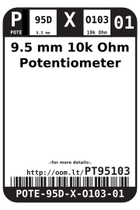
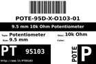
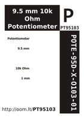
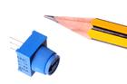
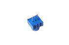

Contents
========

* [PT95103 > 9.5 mm 10k Ohm Potentiometer](#pt95103--95-mm-10k-ohm-potentiometer)
	* [Datasheets](#datasheets)
	* [Labels](#labels)
	* [EDA](#eda)
	* [Images](#images)
	* [Tags](#tags)
  
![][im]
# PT95103 > 9.5 mm 10k Ohm Potentiometer

- ID: POTE-95D-X-O103-01
- Hex ID: PT95103
- Name: 9.5 mm 10k Ohm Potentiometer
- Description: 9.5 mm 10k Ohm Potentiometer
- Long Link: [http://oom.lt/POTE-95D-X-O103-01](http://oom.lt/POTE-95D-X-O103-01)
- Short Link: [http://oom.lt/PT95103](http://oom.lt/PT95103)

## Datasheets

- Datasheet: [datasheet.pdf](datasheet.pdf)

## Labels
  
  

|label-front|label-inventory|label-spec|
| :---: | :---: | :---: |
||||

## EDA

### Symbols

## Images
  
  

|image|image_RE|image_BOTTOM|label-front|label-inventory|label-spec|
| :---: | :---: | :---: | :---: | :---: | :---: |
|||||||

## Tags

- oompID: POTE-95D-X-O103-01
- name: 9.5 mm 10k Ohm Potentiometer
- hexID: PT95103
- oompSort: POTE95DO103
- oompType: POTE
- oompSize: 95D
- oompColor: X
- oompDesc: O103
- oompIndex: 01
- oompVersion: 98
- ooWidth: 9.5 mm
- ooLength: 9.5 mm
- ooDesignator: VR1

[im]: image_450.jpg
