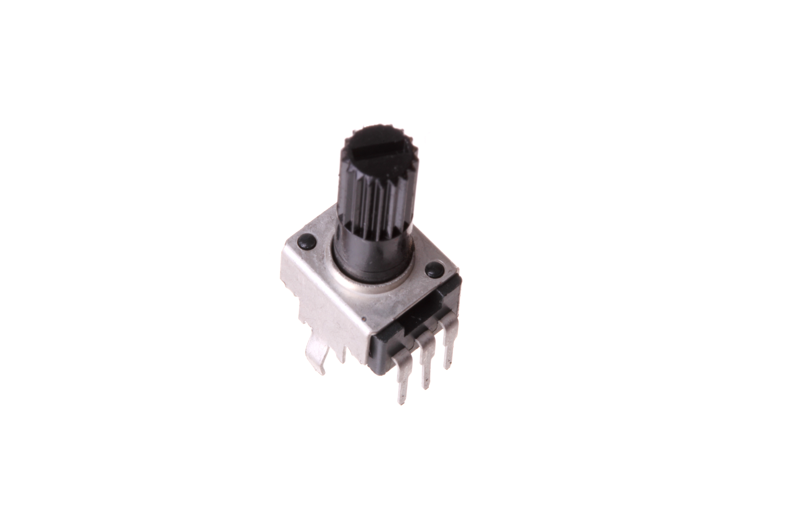
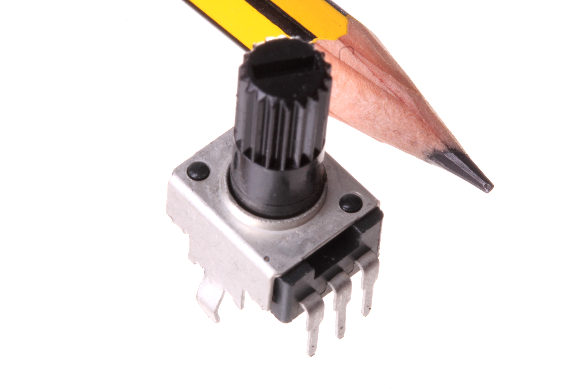
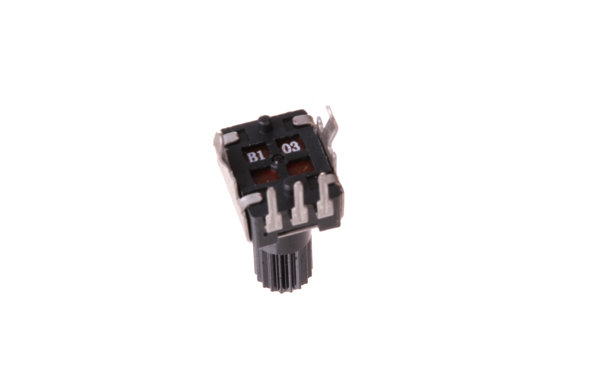

Contents
========

* [POTE-98D-X-O103-01>9.8 mm 10k Ohm Potentiometer](#pote-98d-x-o103-0198-mm-10k-ohm-potentiometer)
	* [Images](#images)
	* [Datasheets](#datasheets)
	* [Labels](#labels)
	* [EDA](#eda)
		* [Symbols](#symbols)
	* [Tags](#tags)
  
![][im]
# POTE-98D-X-O103-01>9.8 mm 10k Ohm Potentiometer

- ID: POTE-98D-X-O103-01
- Name: POTE-98D-X-O103-01

## Images
  
  

|Main|Reference|Bottom|
| :---: | :---: | :---: |
||||

## Datasheets

- Datasheet: [datasheet.pdf](datasheet.pdf)

## Labels
  
  

|Front|Inventory|Specifications|
| :---: | :---: | :---: |
||||

## EDA

### Symbols

## Tags

- oompID: POTE-98D-X-O103-01
- name: 9.8 mm 10k Ohm Potentiometer
- hexID: PT98103
- oompSort: POTE98DO103
- oompType: POTE
- oompSize: 98D
- oompColor: X
- oompDesc: O103
- oompIndex: 01
- oompVersion: 98
- ooWidth: 9.8 mm
- ooLength: 9.8 mm
- ooDesignator: VR1

[im]: image_600.jpg
