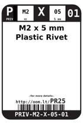
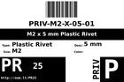

Contents
========

* [PR25 > M2 x 5 mm Plastic Rivet](#pr25--m2-x-5-mm-plastic-rivet)
	* [Datasheets](#datasheets)
	* [Labels](#labels)
	* [EDA](#eda)
	* [Images](#images)
	* [Tags](#tags)

# PR25 > M2 x 5 mm Plastic Rivet

- ID: PRIV-M2-X-05-01
- Hex ID: PR25
- Name: M2 x 5 mm Plastic Rivet
- Description: M2 x 5 mm Plastic Rivet
- Long Link: [http://oom.lt/PRIV-M2-X-05-01](http://oom.lt/PRIV-M2-X-05-01)
- Long Link: [http://oom.lt/PR25](http://oom.lt/PR25)

## Datasheets

- Datasheet: [datasheet.pdf](datasheet.pdf)

## Labels
  
  

|label-front|label-inventory|label-spec|
| :---: | :---: | :---: |
||||

## EDA

### Symbols

## Images
  
  

|label-front|label-inventory|label-spec|
| :---: | :---: | :---: |
||||

## Tags

- oompID: PRIV-M2-X-05-01
- name: M2 x 5 mm Plastic Rivet
- hexID: PR25
- oompSort: PRIVM205
- oompType: PRIV
- oompSize: M2
- oompColor: X
- oompDesc: 05
- oompIndex: 01
- oompVersion: 98
- ooDesignator: 0
