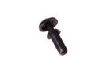

Contents
========

* [PR36 > M3 x 6 mm Plastic Rivet](#pr36--m3-x-6-mm-plastic-rivet)
	* [Images](#images)
	* [Datasheets](#datasheets)
	* [Labels](#labels)
	* [EDA](#eda)
	* [Tags](#tags)
  
![][im]
# PR36 > M3 x 6 mm Plastic Rivet

- ID: PRIV-M3-X-06-01
- Hex ID: PR36
- Name: M3 x 6 mm Plastic Rivet
- Description: M3 x 6 mm Plastic Rivet

## Images
  
  

|image|label-front|label-inventory|label-spec|
| :---: | :---: | :---: | :---: |
|||||

## Datasheets

- Datasheet: [datasheet.pdf](datasheet.pdf)

## Labels
  
  

|label-front|label-inventory|label-spec|
| :---: | :---: | :---: |
||||

## EDA

### Symbols

## Tags

- oompID: PRIV-M3-X-06-01
- name: M3 x 6 mm Plastic Rivet
- hexID: PR36
- oompSort: PRIVM306
- oompType: PRIV
- oompSize: M3
- oompColor: X
- oompDesc: 06
- oompIndex: 01
- oompVersion: 98
- ooDesignator: 0

[im]: image_450.jpg
