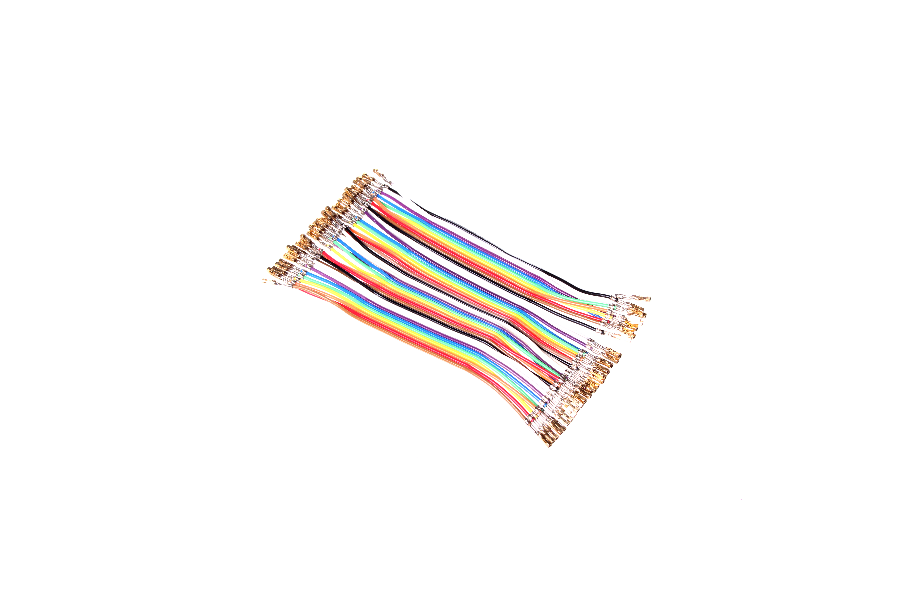
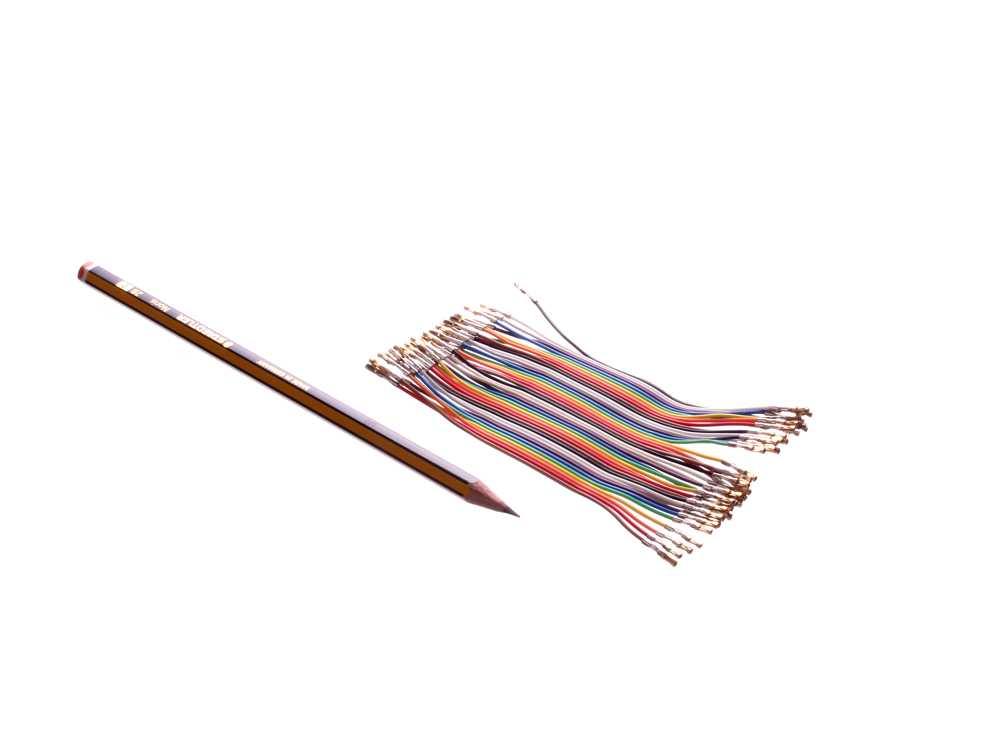
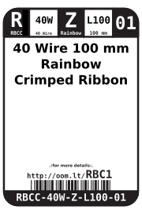
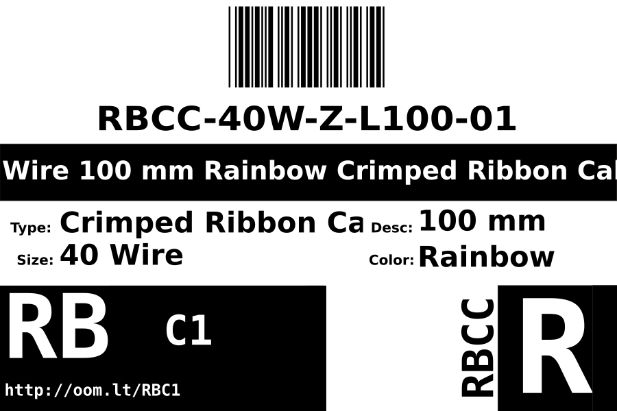

Contents
========

* [RBCC-40W-Z-L100-01>40 Wire 100 mm Rainbow Crimped Ribbon Cable](#rbcc-40w-z-l100-0140-wire-100-mm-rainbow-crimped-ribbon-cable)
	* [Images](#images)
	* [Datasheets](#datasheets)
	* [Labels](#labels)
	* [EDA](#eda)
		* [Symbols](#symbols)
	* [Tags](#tags)
  
![][im]
# RBCC-40W-Z-L100-01>40 Wire 100 mm Rainbow Crimped Ribbon Cable

- ID: RBCC-40W-Z-L100-01
- Name: RBCC-40W-Z-L100-01

## Images
  
  

|Main|Reference|
| :---: | :---: |
|||

## Datasheets

- Datasheet: [datasheet.pdf](datasheet.pdf)

## Labels
  
  

|Front|Inventory|Specifications|
| :---: | :---: | :---: |
||||

## EDA

### Symbols

## Tags

- index: 12739
- index: 4125
- oompID: RBCC-40W-Z-L100-01
- name: 40 Wire 100 mm Rainbow Crimped Ribbon Cable
- hexID: RBC1
- oompSort: 040W100
- oompType: RBCC
- oompSize: 40W
- oompColor: Z
- oompDesc: L100
- oompIndex: 01
- oompVersion: 10
- oompAbout: These 100 mm long cables are best used when making connections between boards that are close to one another as the length doesn&#39t leave much room for play. However given their short length it also means there isn&#39t much wire left over to look messy.
- oompClass: Wiring
- oompClassCode: WIRE

[im]: image_600.jpg
