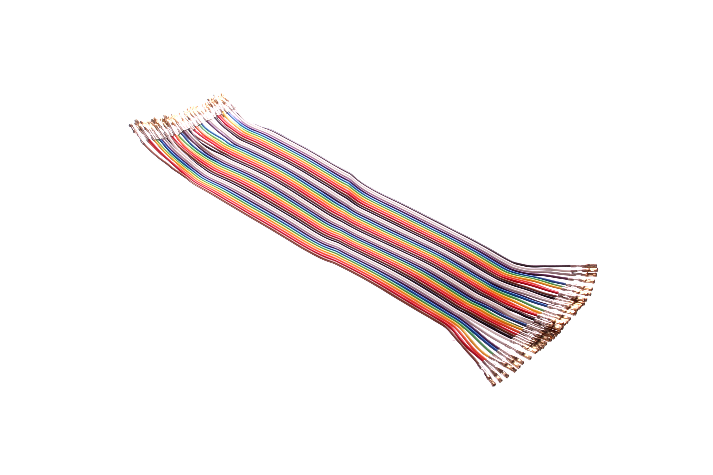
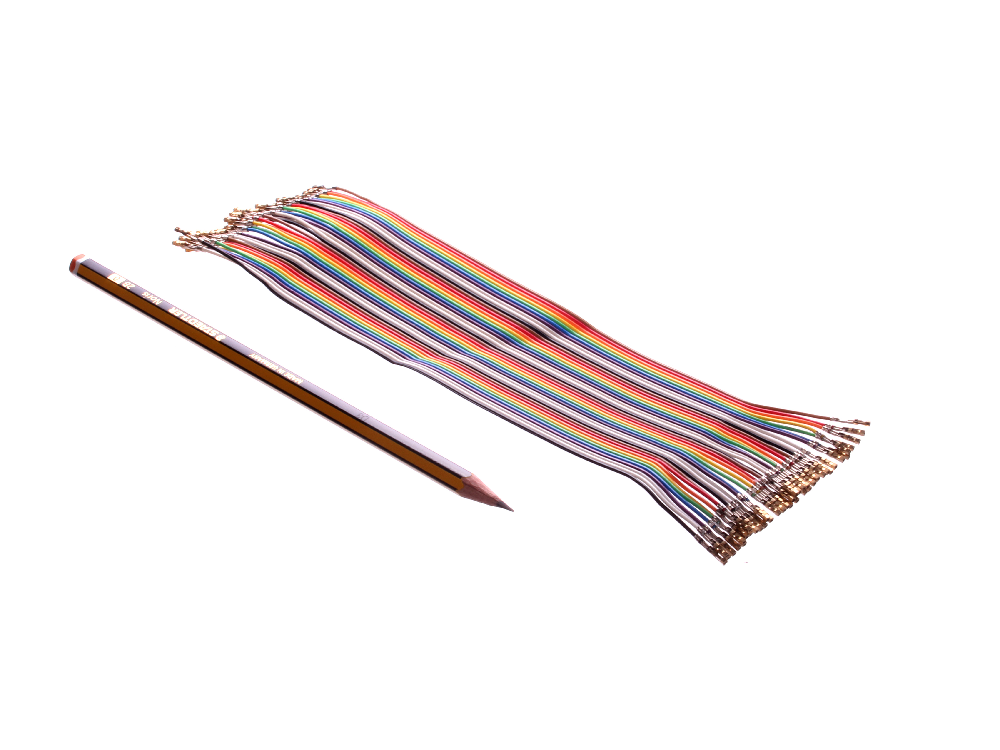
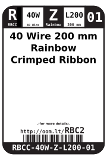
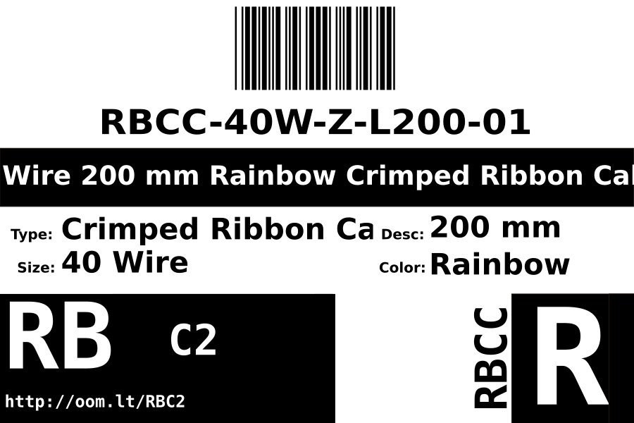
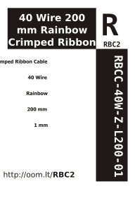

Contents
========

* [RBCC-40W-Z-L200-01>40 Wire 200 mm Rainbow Crimped Ribbon Cable](#rbcc-40w-z-l200-0140-wire-200-mm-rainbow-crimped-ribbon-cable)
	* [Images](#images)
	* [Datasheets](#datasheets)
	* [Labels](#labels)
	* [EDA](#eda)
		* [Symbols](#symbols)
	* [Tags](#tags)
  
![][im]
# RBCC-40W-Z-L200-01>40 Wire 200 mm Rainbow Crimped Ribbon Cable

- ID: RBCC-40W-Z-L200-01
- Name: RBCC-40W-Z-L200-01

## Images
  
  

|Main|Reference|
| :---: | :---: |
|||

## Datasheets

- Datasheet: [datasheet.pdf](datasheet.pdf)

## Labels
  
  

|Front|Inventory|Specifications|
| :---: | :---: | :---: |
||||

## EDA

### Symbols

## Tags

- oompID: RBCC-40W-Z-L200-01
- name: 40 Wire 200 mm Rainbow Crimped Ribbon Cable
- hexID: RBC2
- oompSort: 040W200
- oompType: RBCC
- oompSize: 40W
- oompColor: Z
- oompDesc: L200
- oompIndex: 01
- oompVersion: 10
- ooPitch: 2.54 mm
- ooWireSize: 7/0 0.127
- ooTerminalStyle: Female (Dupont)
- oompAbout: These 200 mm long cables are best used when making connections between boards and perhaps an external face plate where the extra length is needed to allow assembly.
- oompClass: Wiring
- oompClassCode: WIRE

[im]: image_600.jpg
